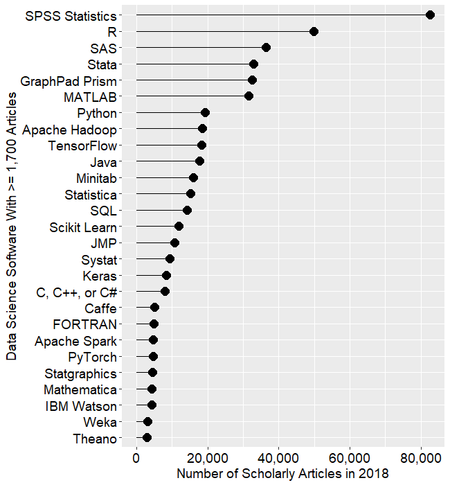
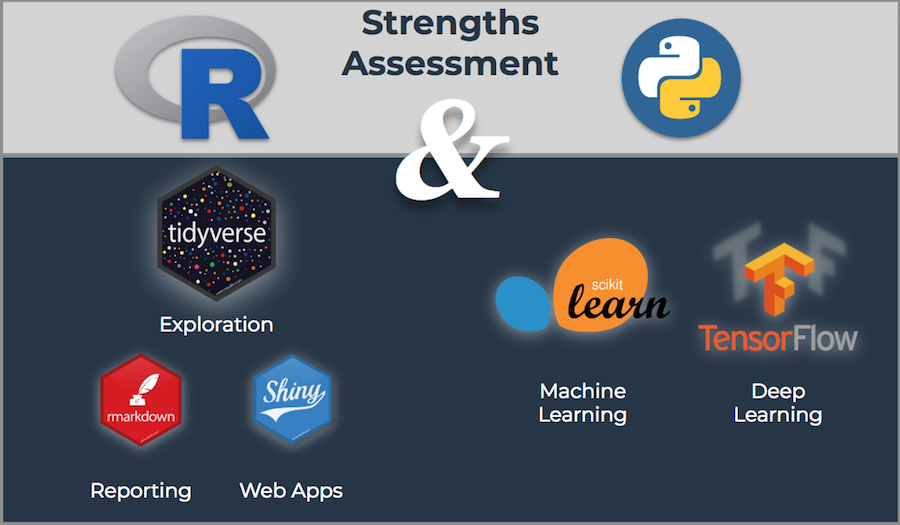

```{r setup, include=FALSE}
knitr::opts_chunk$set(collapse = TRUE, comment = '#>', fig.retina = 2, fig.align = 'center')
```

```{r, echo=FALSE, message=FALSE, warning=FALSE}
library(tidyverse)
library(purrr)
library(lubridate)
```


# 关于这门课

## 谁应该选这门课

我很高兴大家愿意学习这门课

> - 但是
> - 为了保证学习效果，我觉得这门课的主要受众为：
> - 从来没有接触过R或者编程，但是希望通过学习一门语言来提高自己数据处理的效率
> - 能用R进行基本数据操作，但是希望进一步了解R语言强大功能的
> - 学习过其他语言，但是希望用一种更简单的方式来处理数据的

## 谁**不应该**选这门课

由于这门课主要是以R语言实践为主，所以，有些同学可能会比较失望：

> - 精通其他任何一种语言(matlab, python, vba, etc.)，没有必要为了用R而用R
> - 想学习如何解读R语言分析结果的，考虑到大家专业不同，所以我们只会讲最简单的数据建模方法
> - 想学习怎么发文章的，这门课不会教你如何发文章，理由同上

## 这门课讲啥

本课程主要介绍R语言在数据挖掘与可视化中的应用，其目的主要是让大家能够利用R语言从数据中得到有趣和有价值的东西。课程围绕完整的数据分析的5个流程开展：

```{r, echo=FALSE, out.width='60%', fig.align='center', fig.cap='数据分析的一般流程'}
knitr::include_graphics('Figures/data-science-project.png')
```

- 获取数据
- 清理数据
- 探索和可视化数据
- 数据建模并预测
- 结果展示

建议的参考书目：《Learning R》、《Advance R》、《ggplot2: Elegant Graphics for Data Analysis》、《The R Inferno》、《Parallel R》、《The tidyverse style guide》、 《R for Data Science》

# 关于R

## R是什么

- [The R Project for Statistical Computing](https://www.r-project.org/)
- R is a language and environment for statistical computing and graphics. （统计计算和可视化软件）
- It is a GNU project which is similar to the S language and environment which was developed at Bell Laboratories （开源）
- an effective data handling and storage facility （处理和储存数据）
- a suite of operators for calculations on arrays, in particular matrices （向量化计算）
- a large, coherent, integrated collection of intermediate tools for data analysis （数据分析）
- graphical facilities for data analysis and display either on-screen or on hardcopy （可视化工具）
- a well-developed, simple and effective programming language which includes conditionals, loops, user-defined recursive functions and input and output facilities （简单、高效的编程语言）

## 关于开源

```{r, echo=FALSE, out.width='60%'}
knitr::include_graphics('./Figures/openSource.png')
```


# 为什么用R

## Why R

```{r, echo=FALSE, out.width='70%'}
knitr::include_graphics('./Figures/whyR2.png')
```

## 综合实力最强

```{r, echo=FALSE, out.width="70%", message=FALSE, fig.asp=0.6}
library(tidyquant)
library(ggrepel)
library(tibble)
data_apps <- tribble(
  ~application, ~capability, ~ease_of_learning, ~trend, ~cost,   
  "R",          10,                   4,                 10,     "Free",
  "Python",     7,                    4,                 10,     "Free",
  "Excel",      4,                    10,                7,      "Low",
  "Tableau",    6,                    7,                 6,      "Low",
  "PowerBI",    5,                    8,                 6,      "Low",
  "Matlab",     6,                    2,                 1,      "High",
  "SAS",        8,                    4,                 3,      "High"
)
# knitr::kable(data_apps, align = 'c', format = 'html', booktabs = T) %>% kableExtra::kable_styling(position = "center")
data_apps %>%
  ggplot(aes(x = capability, y = ease_of_learning, 
             color = cost, size = trend)) +
  geom_point() +
  geom_label_repel(aes(label = application, fill = application), 
                   size = 3.5,
                   fontface = 'bold', color = 'white',
                   box.padding = 0.1, point.padding = 0.5,
                   segment.color = 'grey50', segment.size = 1, show.legend = F) +
  geom_smooth(color = palette_dark()[[1]], method = "lm", se = FALSE, show.legend = F) +
  expand_limits(x = c(0, 10), y = c(0, 10)) +
  theme_tq() +
  theme(legend.direction = "vertical", 
        legend.position = 'right') +
  scale_fill_tq() +
  scale_color_tq() +
  scale_y_continuous(breaks = seq(0, 10, 2)) +
  scale_x_continuous(breaks = 0:10) +
  scale_size_continuous(range = c(2, 14)) + 
  labs(title = "Capability Vs Learning Curve",
       subtitle = "R has a longer learning curve but has a massive data science capability rating",
       x     = "Data Science Capability Rating",
       y     = "Learning Curve Rating",
       color = "Cost",
       size  = "Trend") +
  coord_equal()

```

## 非计算机专业的人也能轻易上手

```{r, eval=FALSE, echo=FALSE}

for(i in seq_along(urls)) {
  Sys.sleep(0.1)
  if (i %% 10 == 0) cat(".")
  download.file(urls[[i]], paths[[i]])
}

walk2(
  urls, path, 
  download.file %>% dot_every(10) %>% delay_by(0.1), 
  quiet = TRUE
)
```

```{r, echo=FALSE, out.width='50%', fig.align='default'}


```


## `Tidyverse`的出现降低了R语言的学习难度

- 尽管我本人更加倾向于`data.table`
- 但是`Tidyverse`的出现的确为R吸引了大量使用者

```{r, echo=FALSE, out.width='100%', fig.cap=''}
knitr::include_graphics('./Figures/tidyverse2.jpg')

```

## R生态链十分完善

- 很多尖端算法都在R中实现了
    - `H2O` High-end machine learning package
    - `Keras`/`TensorFlow` - Go-to deep learning packages
    - `xgboost` - Top Kaggle algorithm
- 使用`tidyverse`理念，可以用一致的接口编写大量的拓展
    - 可以用`dplyr`和`tidyr`来处理数据
    - 用`stingr`来处理字符串，用`lubridate`处理时间数据，用`forcast`来处理因子（`factor`）
    - 用`ggplot2`来做数据可视化
    - 用`purrr`来进行函数式编程
    - 用`shiny`和`Rmarkdown`来做展示
- R有多种编程方式
    - 向量化计算
    - 函数式编程（`purrr`）
    - 并行化（`parallel`， `future`）
    - 和其他语言耦合（`Rcpp`，`rJava`， `reticulate`）
    - 和数据库结合（`dbplyr`，`odbc`，`bigrquery`）

## R有良好的社区支持

- R是一个开源的、免费的、多平台的统计软件（语言）
- 随着R语言的易用性逐渐增强，R变得越来越受欢迎

```{r, echo=FALSE, out.width='50%', fig.align='default', fig.cap=''}
knitr::include_graphics('Figures/ds_trend.png')

```

- 可以轻易在网上找到帮助
    - [R-Bloggers](https://www.r-bloggers.com/)
    - [rstats](https://github.com/topics/rstats)
    - [The R Project for Statistical Computing](https://www.r-project.org/)
    

# R能做什么

## 做动画

```{r, eval=FALSE, echo=FALSE}
ggplot(
  gapminder, 
  aes(x = gdpPercap, y=lifeExp, size = pop, colour = country)
  ) +
  geom_point(show.legend = FALSE, alpha = 0.7) +
  scale_color_viridis_d() +
  scale_size(range = c(2, 12)) +
  scale_x_log10() +
  labs(x = "GDP per capita", y = "Life expectancy") +
  transition_time(year) +
  labs(title = "Year: {frame_time}") +
  shadow_mark(alpha = 0.3, size = 0.5)
```

```{r, eval=FALSE, echo=FALSE}
theme_set(theme_bw())
p <- ggplot(
  gapminder, 
  aes(x = gdpPercap, y=lifeExp, size = pop, colour = country)
  ) +
  geom_point(show.legend = FALSE, alpha = 0.7) +
  scale_color_viridis_d() +
  scale_size(range = c(2, 12)) +
  scale_x_log10() +
  labs(x = "GDP per capita", y = "Life expectancy")
p2 <- p + transition_time(year) +
  labs(title = "Year: {frame_time}")
p3 <- p + facet_wrap(~continent) +
  transition_time(year) +
  labs(title = "Year: {frame_time}")
p4 <- p + transition_time(year) +
  labs(title = "Year: {frame_time}") +
  shadow_wake(wake_length = 0.1, alpha = FALSE)
p5 <- p + transition_time(year) +
  labs(title = "Year: {frame_time}") +
  shadow_mark(alpha = 0.3, size = 0.5)
gganimate::anim_save('./Figures/gganimate-2.gif', p2)
gganimate::anim_save('./Figures/gganimate-3.gif', p3)
gganimate::anim_save('./Figures/gganimate-4.gif', p4)
gganimate::anim_save('./Figures/gganimate-5.gif', p5)

lp <- ggplot(
  airquality,
  aes(Day, Temp, group = Month, color = factor(Month))
  ) +
  geom_line() +
  scale_color_viridis_d() +
  labs(x = "Day of Month", y = "Temperature") +
  theme(legend.position = "top")
lp2 <- lp + geom_point(aes(group = seq_along(Day))) +
  transition_reveal(Day)
gganimate::anim_save('./Figures/gganimate-6.gif', lp2)
mean.temp <- airquality %>%
  group_by(Month) %>%
  summarise(Temp = mean(Temp))

bp <- ggplot(mean.temp, aes(Month, Temp, fill = Temp)) +
  geom_col() +
  scale_fill_distiller(palette = "Reds", direction = 1) +
  theme_minimal() +
  theme(
    panel.grid = element_blank(),
    panel.grid.major.y = element_line(color = "white"),
    panel.ontop = TRUE
  )

bp <- bp + transition_states(Month, wrap = FALSE) +
  shadow_mark()
gganimate::anim_save('./Figures/gganimate-7.gif', bp)
```

```{r, out.width='33%', echo = F, fig.align='default'}
knitr::include_graphics('./Figures/gganimate-5.gif')

knitr::include_graphics('./Figures/gganimate-7.gif')
```


## 统计分析

```{r, eval=TRUE, echo=F, out.width='70%'}
knitr::include_graphics('./Figures/bbc.png')
```

## 做词云

```{r, eval=FALSE, echo=FALSE, fig.align='default', out.width='50%'}
library(wordcloud2)
wordcloud2(data = demoFreq)
```

```{r, echo=FALSE, out.width='50%', fig.align='default'}

knitr::include_graphics('./Figures/wordCloud-2.png')
```

## 下载和处理遥感数据

```{r, echo=FALSE, eval=TRUE, out.width='70%'}
knitr::include_graphics('Figures/modistsp2.gif')
knitr::include_graphics('Figures/climate-app.gif')
```

## 做网页

```{r, echo=FALSE, eval=TRUE, fig.align='default', out.width='50%'}
knitr::include_graphics('Figures/product_price_prediction_app.gif')
knitr::include_graphics('Figures/shiny_employee_churn_predictor_app.gif')
```

# R vs Python?

```{r, echo=FALSE, out.width='60%', fig.cap=''}

```

## R vs Python （R优势）
- R语言主要用来做统计、数据分析、数据探索以及数据可视化
- `RMarkdown`的出现让报告和交流变得更加简单
- `Shiny`则让R语言用户能够轻松制作网页
- `tidyverse`的出现让R进入了快速增长期

```{r, echo=FALSE, out.width='60%', fig.cap=''}

```

## R vs Python （Python优势）

- Python是一种通用性语言
- Python 主要服务于计算机科学（CS）以及数学
- Python拥有出色的及其学习库，如`Scikit Learn`和`Tensorflow`

```{r, echo=FALSE, out.width='60%', fig.cap=''}
knitr::include_graphics('./Figures/sklearn_ml_flowchart.png')
```

## R + Python! 

> When you learn multiple languages, you gain the ability to select the best tool for the job. --Matt Dancho

- 不要拘泥于一种工具，这样才能在数据分析的过程中选择最适合的
- 用R来探索数据（`tidyverse`）
- 用Python来做机器学习（`Scikit Learn`）
- 用R来交流数据（`Rmakdown`, `ggplot2`, `shiny`）

```{r, echo=FALSE, out.width='70%', fig.cap=''}
knitr::include_graphics('./Figures/python_r_workflow.png')
```


# 胶水语言(Glue Language)

```{r, eval=TRUE, echo=F, out.width='90%'}
knitr::include_graphics('./Figures/R_glue.png')
```

## R + Python (`reticulate`)

```{r, eval=TRUE, echo=F, out.width='50%'}
knitr::include_graphics('./Figures/R_Python.png')
knitr::include_graphics('./Figures/r_python_shiny.gif')
```

## R + CPP (`Rcpp`)

```{r, eval=TRUE, echo=F, out.width='70%'}
knitr::include_graphics('./Figures/rcpp-with-xcode-demo.gif')
```

# R语言版本

R语言的官方发行版本可以从<https://cran.r-project.org/>下载得到，截止到今天，最新的官方版本为4.0.2

Mricrosoft R open (MRO)是微软公司增强的R发行版。当前版本Microsoft R Open 3.5.3基于统计语言R-3.5.3，并包含了用于改进性能、可重复性和多平台支持的额外功能。下载网址为：<https://mran.revolutionanalytics.com/>

**如果MRO持续更新，建议大家使用Microsoft R open作为大家的首选R后端**

- 完全兼容R语言的官方版本
- 预装了官方推荐以及微软提供的专用R包
- **提供多线程数学库的支持**
- **提供官方代码库的镜像**
- **能使用checkpoint包来编写可复现的R代码**

# Rstudio

RStudio是一款R语言的IDE，具有调试、可视化等功能，支持纯R脚本、Rmarkdown (脚本文档混排)、Bookdown (脚本文档混排成书)、Shiny (交互式网络应用)等。下载地址为：<https://www.rstudio.com/>

**RStudio是我们的首选R语言IDE**

```{r, out.width='60%', fig.align='center', fig.cap='Rstdio操作界面', echo=FALSE}

```

## Rstudio优点

- 代码字体高亮，代码完整性智能识别、自动缩进
- 可直接执行 R 程序代码
- 可运行多个 R 程序
- **可直接浏览工作表和数据**
- 可随意缩放绘制的图形，并且有多种输出格式
- 整合 R 帮助和 R 使用文档
- 可查看 R 命令的运行记录

## Rstudio快捷键

```{r, out.width='80%', fig.align='center', fig.cap='Rstdio快捷键', echo=FALSE}
knitr::include_graphics('Figures/rstudio_shortcuts.png')
```

# R程序包（R packages）

## 程序包作用

**R程序包是什么**

- R程序包是多个函数的集合，具有详细的说明和示例。
- Window下的R程序包是经过编译的zip包。
- 每个程序包包含R函数、数据、帮助文件、描述文件等。

**为什么要安装程序包**

- R程序包是R功能扩展，特定的分析功能，需要用相应的程序包实现。
- 避免重复造轮子（re-invent the wheel）

## R有多少程序包？

- 截止目前（2019/09/10），CRAN上共有18,159个R程序包, 共有2,651,843个函数

```{r, out.width='100%', fig.align='center', echo=FALSE}
knitr::include_graphics('Figures/rpkgs.png')
```

## 我们应该学用什么程序包 （`tidyverse`）

我们从爬取了一个博主写的代码，并分析了他用到的包和函数（主要是做二维数据处理和建模的），结果如下：

```{r, echo=F, fig.align='center', out.width='70%'}
knitr::include_graphics('./Figures/web_functions.png')
```

```{r, echo=FALSE, eval=FALSE, fig.align='center', out.width='70%', message=FALSE, warning=FALSE}
library(tidyverse)
library(tidyquant)
library(tibbletime)
library(rvest)
library(broom)
library(tibbletime)
library(fs)
count_to_pct <- function(data, ..., col = n) {
  
  grouping_vars_expr <- quos(...)
  col_expr <- enquo(col)
  
  data %>%
    group_by(!!! grouping_vars_expr) %>%
    mutate(pct = (!! col_expr) / sum(!! col_expr)) %>%
    ungroup()
}

parse_function_names <- function(text, stop_words = c("")) {
  
  parser <- function(text, stop_words) {
    ret <- text %>%
      str_c(collapse = " ") %>%
      str_split("\\(") %>%
      set_names("text") %>%
      as.tibble() %>%
      slice(-n()) %>%
      mutate(str_split = map(text, str_split, " ")) %>%
      select(-text) %>%
      unnest() %>%
      mutate(function_name = map_chr(str_split, ~ purrr::pluck(last(.x)))) %>%
      select(function_name) %>%
      separate(function_name, into = c("discard", "function_name"), 
               sep = "(:::|::|\n)", fill = "left") %>%
      select(-discard) %>%
      mutate(function_name = str_replace_all(function_name, 
                                             pattern = "[^[:alnum:]_\\.]", "")) %>%
      filter(!(function_name %in% stop_words)) 
    
    return(ret)
  }
  
  safe_parser <- possibly(parser, otherwise = NA)
  
  safe_parser(text, stop_words)
}

find_functions_in_package <- function(package) {
  
  pkg_text <- paste0("package:", package)
  
  safe_ls <- possibly(ls, otherwise = NA)
  
  package_functions <- safe_ls(pkg_text)
  
  if (is.na(package_functions[[1]])) return(package_functions)
  
  ret <- package_functions %>%
    as.tibble() %>%
    rename(function_name = value)
  
  return(ret)
}

find_loaded_packages <- function() {
  
  ret <- search() %>%
    list() %>% 
    set_names("search") %>%
    as.tibble() %>%
    separate(search, into = c("discard", "keep"), sep = ":", fill = "right") %>%
    select(keep) %>%
    filter(!is.na(keep)) %>%
    rename(package = keep) %>%
    arrange(package)
  
  return(ret)
}

map_loaded_package_functions <- function(data, col) {
  
  col_expr <- enquo(col)
  
  data %>%
    mutate(function_name = map(!! col_expr, find_functions_in_package)) %>%
    mutate(is_logical = map_dbl(function_name, is.logical)) %>%
    filter(is_logical != 1) %>%
    select(-is_logical) %>%
    unnest()
}

path <- "http://varianceexplained.org/r/mixture-models-baseball/"

# Get the loaded functions (joined in last step)
loaded_functions_tbl <- find_loaded_packages() %>%
  map_loaded_package_functions(package) 

# Read in HTML as text for all code attributes on the page
html_code_text <- read_html(path) %>% 
  html_nodes("code") %>%    
  html_text()

# Parse function names and join with loaded functions
# Note that stats::filter and dplyr::filter conflict
# We replace any missing packages with "Unknown"
mixture_models_code_tbl <- html_code_text %>%
  parse_function_names() %>%
  left_join(loaded_functions_tbl) %>%
  filter(!(function_name == "filter" & !(package == "dplyr"))) %>%
  mutate(package = case_when(is.na(package) ~ "Unknown", TRUE ~ package))
# 
# mixture_models_code_tbl %>% glimpse()
# 
# mixture_models_code_tbl %>%
#   count(package, function_name) %>%
#   count_to_pct() %>%
#   arrange(desc(n)) %>%
#   top_n(5)

posts_path <- "http://varianceexplained.org/posts/"

# Extract the post titles
titles_vec <- read_html(posts_path) %>%
  html_node("#main") %>%
  html_nodes("article") %>%
  html_nodes("a") %>%
  html_text(trim = TRUE) 

# Extract the post dates
dates_vec <- read_html(posts_path) %>%
  html_node("#main") %>%
  html_nodes("article") %>%
  html_nodes("p.dateline") %>%
  html_text(trim = TRUE) %>%
  mdy()

# Extract the post hrefs
hrefs_vec <- read_html(posts_path) %>%
  html_node("#main") %>%
  html_nodes("article") %>%
  html_nodes("a") %>%
  html_attr("href") 

# Bind the data together in a tibble
variance_explained_tbl <- bind_cols(
  title = titles_vec, 
  date  = dates_vec, 
  href  = hrefs_vec)

# First six posts shown
# variance_explained_tbl %>% 
#   head() %>%
#   knitr::kable()

build_function_names_tbl_from_url_path <- function(path, loaded_functions_tbl) {
  
  builder <- function(path, loaded_functions_tbl) {
    read_html(path) %>% 
      html_nodes("code") %>%    
      html_text() %>%
      parse_function_names() %>%
      left_join(loaded_functions_tbl) %>%
      filter(
        !(function_name == "filter" & !(package == "dplyr"))
      ) %>%
      mutate(package = ifelse(is.na(package), "Unknown", package))
  }
  
  safe_builder <- possibly(builder, otherwise = NA)
  
  safe_builder(path, loaded_functions_tbl)
}

path <- "http://varianceexplained.org/r/mixture-models-baseball/"
# build_function_names_tbl_from_url_path(path, loaded_functions_tbl) %>%
#   glimpse()

variance_explained_tbl <- bind_cols(
  title = titles_vec, 
  date = dates_vec, 
  href = hrefs_vec) %>%
  mutate(
    function_name = map(href, build_function_names_tbl_from_url_path, loaded_functions_tbl),
    is_logical    = map_dbl(function_name, is.logical)
  ) %>%
  filter(is_logical == 0) %>%
  select(-is_logical) %>%
  unnest() 

# variance_explained_tbl %>% glimpse()

ve_functions_top_20_tbl <- variance_explained_tbl %>%
  count(package, function_name) %>%
  count_to_pct() %>%
  arrange(desc(n)) %>%
  top_n(20) %>%
  mutate(function_name = as_factor(function_name) %>% fct_reorder(n)) %>%
  arrange(desc(function_name)) %>%
  mutate(package = as_factor(package)) 

# ve_functions_top_20_tbl %>% glimpse()

ve_functions_top_20_tbl %>%
  ggplot(aes(x = n, y = function_name, color = package)) +
  geom_segment(aes(xend = 0, yend = function_name), size = 2) +
  geom_point(size = 4) +
  geom_label(aes(label = paste0(function_name, "(), ", package, ", ", scales::percent(pct))), 
             hjust = "inward", size = 3.5) +
  expand_limits(x = 0) +
  labs(
    title = "Which Functions Are Most Frequently Used by DRob?",
    subtitle = "Variance Explained Blog",
    x = "Function Count (n)", y = "Count of R Functions (n)") +
  scale_color_tq() +
  theme_tq() +
  theme(legend.position = "none")
# ve_package_frequency_tbl <- variance_explained_tbl %>%
#   select(date, package, function_name) %>%
#   mutate(package = as.factor(package) %>% fct_lump(n = 5, other_level = "Other")) %>%
#   arrange(date) %>%
#   as_tbl_time(index = date) %>%
#   collapse_by(period = "6 m", clean = TRUE) %>%
#   count(date, package) %>%
#   count_to_pct(date) %>%
#   mutate(biannual = paste0("H", semester(date))) 
# 
# ve_package_frequency_tbl %>% glimpse()
# 
# ve_package_frequency_tbl %>%
#   ggplot(aes(date, n, fill = package)) +
#   geom_bar(stat = "identity") +
#   geom_text(aes(x = date, y = n, label = biannual), 
#             vjust = -1, color = palette_light()[[1]], size = 3) +
#   geom_smooth(method = "lm", se = FALSE) +
#   facet_wrap(~ package, ncol = 3) +
#   scale_fill_tq() +
#   theme_tq() +
#   labs(
#     title = "Which Packages Are Most Frequently Used by DRob?",
#     subtitle = "Variance Explained Blog",
#     x = "Date (Bi-Annual Aggregation)", y = "Count of R Functions (n)"
#   )

# ve_package_frequency_tbl %>%
#   ggplot(aes(date, pct, fill = package)) +
#   geom_bar(stat = "identity") +
#   geom_text(aes(x = date, y = pct, label = biannual), 
#             vjust = -1, color = palette_light()[[1]], size = 3) +
#   geom_smooth(method = "lm", se = FALSE) +
#   facet_wrap(~ package, ncol = 3) +
#   scale_y_continuous(labels = scales::percent) +
#   scale_fill_tq() +
#   theme_tq() +
#   labs(
#     title = "Which Packages Are Most Frequently Used by DRob?",
#     subtitle = "Variance Explained Blog",
#     x = "Date (Bi-Annual Aggregation)", y = "% of Total R Functions [n / sum(n)]"
#   )

# ve_package_frequency_tbl %>%
#   uncount(weights = n) %>%
#   count(package) %>%
#   count_to_pct() %>%
#   arrange(desc(n)) %>%
#   mutate(pct_cum = cumsum(pct)) %>%
#   knitr::kable()
# 
# ve_tidiness_tbl <- variance_explained_tbl %>%
#   select(date, function_name, package) %>%
#   mutate(tidy_function = case_when(
#     package %in% tidyverse_packages() ~ "Yes", 
#     TRUE ~ "No"))
# 
# ve_tidiness_tbl %>% glimpse()
# 
# ve_tidiness_tbl %>%
#   count(tidy_function) %>%
#   count_to_pct() %>%
#   arrange(desc(n)) %>%
#   knitr::kable()
# 
# ve_tidiness_over_time_tbl <- ve_tidiness_tbl %>%
#   select(date, tidy_function, function_name, package) %>%
#   arrange(date) %>%
#   as_tbl_time(index = date) %>%
#   collapse_by(period = "6 m", clean = TRUE) %>%
#   count(date, tidy_function) %>%
#   count_to_pct(date) %>%
#   filter(tidy_function == "Yes") %>%
#   mutate(biannual = paste0("H", semester(date)))
# 
# glimpse(ve_tidiness_over_time_tbl)
# 
# ve_tidiness_over_time_tbl %>%
#   ggplot(aes(date, pct)) +
#   geom_bar(stat = "identity", fill = palette_light()[[1]], color = "white") +
#   geom_text(aes(x = date, y = pct, label = biannual), 
#             vjust = -1, color = palette_light()[[1]], size = 3) +
#   geom_text(aes(x = date, y = pct, label = scales::percent(pct)), 
#             vjust = 2, color = "white", size = 3) +
#   geom_smooth(method = "lm", se = FALSE) +
#   scale_y_continuous(labels = scales::percent) +
#   scale_fill_tq() +
#   theme_tq() +
#   labs(
#     title = 'How "Tidy" Is DRobs Code?',
#     subtitle = "Variance Explained Blog",
#     x = "Date (Bi-Annual Aggregation)", y = "% of Total R Functions [n / sum(n)]"
#   ) +
#   expand_limits(y = 1)

# ve_eighty_twenty_tbl <- variance_explained_tbl %>%
#   count(package, function_name) %>%
#   count_to_pct() %>%
#   arrange(desc(pct)) %>%
#   mutate(
#     pct_cum = cumsum(pct),
#     high_usage = case_when(
#       pct_cum <= 0.8 ~ "Yes",
#       TRUE ~ "No"
#     )) 

# ve_eighty_twenty_tbl %>% glimpse()
# 
# ve_eighty_twenty_tbl %>%
#   count(high_usage) %>%
#   count_to_pct(col = n) %>%
#   knitr::kable()
# 
# ve_eighty_twenty_tbl %>%
#   filter(high_usage == "Yes") %>%
#   split(.$package)

```

<!-- # 我用`data.table`... -->

<!-- ```{r, echo=F, fig.align='center', out.width='70%', message=FALSE, warning=FALSE} -->
<!-- dir_path <- "E:/RProject" -->
<!-- # dir_info(dir_path, recurse = TRUE) %>%  -->
<!-- #   head() %>% -->
<!-- #   knitr::kable() -->

<!-- rmd_or_r_file_paths_tbl <- dir_info(dir_path, recurse = T) %>% -->
<!--   mutate(file_name = path_file(path)) %>% -->
<!--   select(file_name, path) %>% -->
<!--   filter(str_detect(file_name, "(\\.R|\\.Rmd)$"))  -->

<!-- # rmd_or_r_file_paths_tbl %>% knitr::kable() -->

<!-- build_function_names_tbl_from_file_path <- function(path, loaded_functions_tbl) { -->

<!--   builder <- function(path, loaded_functions_tbl) { -->
<!--     readLines(path) %>% -->
<!--       parse_function_names() %>% -->
<!--       left_join(loaded_functions_tbl) %>% -->
<!--       filter( -->
<!--         !(function_name == "filter" & !(package == "dplyr")) -->
<!--       ) %>% -->
<!--       mutate(package = ifelse(is.na(package), "Unknown", package)) -->
<!--   } -->

<!--   safe_builder <- possibly(builder, otherwise = NA) -->

<!--   safe_builder(path, loaded_functions_tbl) -->
<!-- } -->

<!-- local_function_names_tbl <- rmd_or_r_file_paths_tbl %>% -->
<!--   mutate( -->
<!--     function_name = map(path, build_function_names_tbl_from_file_path, loaded_functions_tbl), -->
<!--     is_logical    = map_dbl(function_name, is.logical) -->
<!--   ) %>% -->
<!--   filter(is_logical != 1) %>% -->
<!--   select(file_name, function_name) %>% -->
<!--   unnest() %>% -->
<!--   left_join(loaded_functions_tbl) -->

<!-- # local_function_names_tbl %>% glimpse() -->

<!-- local_functions_top_20_tbl <- local_function_names_tbl %>% -->
<!--   count(package, function_name) %>% -->
<!--   count_to_pct() %>% -->
<!--   arrange(desc(n)) %>% -->
<!--   top_n(20) %>% -->
<!--   rowid_to_column(var = "rank") -->

<!-- local_functions_top_20_tbl %>% -->
<!--   ggplot(aes(x = n, y = fct_reorder(function_name, n), color = package)) + -->
<!--   geom_segment(aes(xend = 0, yend = function_name), size = 2) + -->
<!--   geom_point(size = 4) + -->
<!--   geom_label(aes(label = paste0(function_name, "(), ", package, ", ", scales::percent(pct))),  -->
<!--              hjust = "inward", size = 3.5) + -->
<!--   expand_limits(x = 0) + -->
<!--   labs( -->
<!--     title = "Which Functions Are Most Frequently Used by Me?", -->
<!--     x = "Function Count (n)", y = "Count of R Functions (n)") + -->
<!--   scale_color_tq() + -->
<!--   theme_tq() + -->
<!--   theme(legend.position = "none") -->

<!-- local_functions_top_20_tbl %>% -->
<!--   filter(function_name %in% ve_functions_top_20_tbl$function_name) %>% -->
<!--   knitr::kable() -->

<!-- local_functions_top_20_tbl %>% -->
<!--   filter(!function_name %in% ve_functions_top_20_tbl$function_name) %>% -->
<!--   knitr::kable() -->
<!-- ``` -->

## 安装R程序包（菜单安装）

- 菜单安装

在联网状态下，在Rstudio的**Packages**菜单下，选择**Install**，
在弹出的窗口中输入想要安装的包的名字，点击**Install**即可。

```{r, out.width='60%', fig.align='center', fig.cap='联网安装R程序包', echo=FALSE}
knitr::include_graphics('Figures/install_package.png')
```
**此方法适用于安装CRAN上发布的程序包**

## 安装R程序包（本地安装）

- 本地安装

在联网状态下，在Rstudio的**Packages**菜单下，选择**Install**，
在弹出的窗口中安装源选择本地文件，点击**Install**即可。

```{r, echo=FALSE, out.width='60%', fig.align='center', fig.cap='本地安装R程序包'}
knitr::include_graphics('Figures/install_package_local.png')
```
**此方法适用于安装本地已经下载完成的程序包**

## 安装R程序包（命令安装）

- 命令安装

```{r, eval=FALSE, echo=TRUE}
install.packages("ggplot2")
install.packages("tidyverse")
```

**此方法与菜单安装效果相同**

- 安装github上的程序包

```{r, eval=FALSE, echo=TRUE}
devtools::install_github('hxfan1227/efdcr')
```

**此方法适用于安装未在CRAN上发布的程序包**

## R程序包安装配置（默认路径）

- 设置R程序包的默认安装路径

```{r, out.width='80%', fig.align='center', fig.cap='系统环境变量', echo=FALSE}

```
在系统环境变量中添加一个新的变量*R_LIBS_USER*，将它设置成想要的安装路径。
设置完成后重启Rstudio即可。

## R程序包安装配置（默认安装源）

- 设置R程序包的默认安装源

在R语言的安装路径下会有一个etc文件夹。
其中包含一个**Rprofile.site**的文件。修改其中的第16行代码。
改成以下任意一个镜像即可。

```{r, eval=FALSE, echo=TRUE}
r["CRAN"] <- 'https://mirrors.tuna.tsinghua.edu.cn/CRAN/'
r["CRAN"] <- 'http://mirrors.opencas.cn/cran/'
r["CRAN"] <- 'http://mirrors.tuna.tsinghua.edu.cn/CRAN/'
```

```{r, out.width='50%', fig.align='default', echo=FALSE}


```


## 如何使用R程序包（library）
- 当你安装程序包后，无法立即使用其中的*函数*,必须先将其*导入*
- 第一个R函数`library()` 使用`?library`查看该函数的使用说明
- `library()`可以用来导入将要使用的程序包。

```{r, echo=TRUE, eval=FALSE}
library(tidyverse)
```

- 也可以使用`require()`函数来导入程序包，使用`?require`来查看该函数的说明
- `require()`和`library()`的功能基本类似，但是`require()`可以在运行后返回导入成功与否
- R语言中的程序包更新比较频繁，应该及时更新, 使用`update.packages()`函数来更新所有的程序包
- 当你安装并导入程序包后，你就可以直接调用其中的函数

```{r, echo=TRUE, eval=FALSE}
library(ggplot2)
ggplot2()
```

- 如果你想显式调用程序包中的函数，可以使用`::`运算符（`?'::'`）
```{r, echo=TRUE, eval=FALSE}
library(ggplot2)
ggplot2::theme_bw()
```

## 如何运行R代码
- 打开你的RStudio
- 点击File -> New -> R Script新建一个R脚本文件 （Ctrl + Shift + N）
- 在新建的R脚本文件中输入**合法**的R语言代码，选中代码并按下Ctrl + Enter

```{r, echo=TRUE, eval=TRUE}
1 + 1
```

- 如果你直接在Console里面运行R代码，可能的显示为：

```{r, echo=TRUE, eval=FALSE}
> 1 + 1
[1] 2
```

# 获取帮助

## 如何获取帮助
- 使用R语言内置的帮助文件
```{r, eval=FALSE, echo=TRUE}
?plot # help("plot")
??plot # help.search("plot")
apropos("plot")
vignette('tidy-data') # vignette()
example(plot)
demo()
demo(plotmath)
browseVignettes()
RSiteSearch('moving average)
```
- 使用sos程序包
```{r, eval=FALSE, echo=TRUE}
sos::findFn('moving average')
```
- Stack Overflow  <https://stackoverflow.com/>
- GitHub  <https://github.com/>
- Google  <https://www.google.com.hk/>
- R cheatsheets <https://www.rstudio.com/resources/cheatsheets/>

## 如何有效的提问
当你发现你的问题无法很好的被解答时，制作一个可以复现的例子（[reproducible example or reprex on stackoverflow](https://stackoverflow.com/questions/5963269/how-to-make-a-great-r-reproducible-example)）

当你提问时，做好以下三件事情：

- 程序包在代码的一开始就载入，并且及时更新，有的bug会随着程序包的更新而消失
- 使用`dput()`函数生成的R代码来复现你的数据，例如我们要复现`mtcars`数据集，步骤如下：
    - 在R中运行`dput(mtcars)`
    - 将输出拷贝
    - 在你提问的代码中输入`mtcars <- `，然后粘贴
- 花点时间完善你的代码，便于让别人看懂：
    - 变量命名有意义
    - 使用注释（`#`）指出问题所在
    - 尽最大可能删除一切不必要的内容
