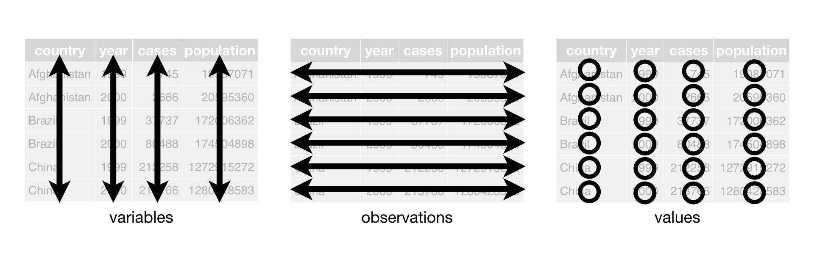
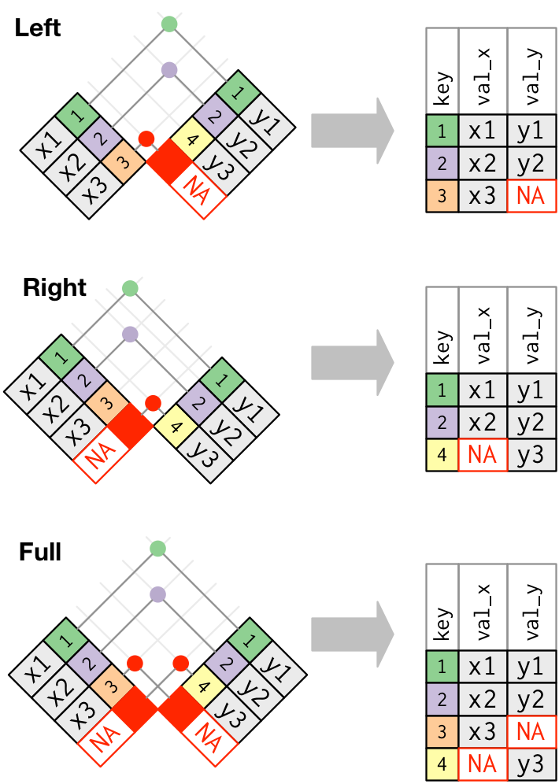

```{r setup, include=FALSE}
knitr::opts_chunk$set(echo = TRUE, warning = FALSE, 
                      message = FALSE, comment = '#>',
                      fig.align = 'center')
```

```{r, echo=FALSE, message=FALSE, warning=FALSE}
library(tidyverse)
library(purrr)
library(lubridate)
library(nycflights13)
```

# 数据导入

## 导入数据到R

```{r, echo=FALSE, out.width='80%', fig.align='center'}
knitr::include_graphics('./Figures/foreign_data_into_r.png')
```

## 导入数据的包

Packages      | 数据类型
--------------|--------------------------
__readr__     | 文本的数据（.txt, .csv）
__data.table__| 文本的数据（.txt, .csv）
__haven__     | SPSS、Stata以及SAS文件
__readxl__    | Excel文件（.xls & .xlsx）
__DBI__       | 数据库
__jsonlite__  | json文件
__xmls2__     | XML文件
__httr__      | 网络接口
__rvest__     | 网络爬虫
__R.matlab__  | matlab文件（.mat）
__sf__        | 矢量数据
__raster__    | 栅格数据
__ncdf4__     | netCDF数据（.nc）

## readr

- 使用`read_*()`读取文本数据

```{r, echo=TRUE, eval=FALSE}
read_*(file, col_names = TRUE, col_types = NULL, locale = default_locale(), 
       na = c("", "NA"), quoted_na = TRUE, comment = "", trim_ws = TRUE, 
       skip = 0, n_max = Inf, guess_max = min(1000,n_max), progress = interactive())
```

```{r, echo=FALSE, out.width='80%', fig.align='center'}
knitr::include_graphics('./Figures/read_csv.png')
```

## 一些比较有用的参数

```{r, echo=FALSE, out.width='80%', fig.align='center'}
knitr::include_graphics('./Figures/read_csv_useful_args.png')
```

## 数据保存

- `x`是一个R里面的对象
- `path`是一个路径
- 将`x`保存到`path`中

```{r, eval=FALSE}
# Comma delimited file
write_csv(x, path, na = "NA", append = FALSE, col_names = !append)
# File with arbitrary delimiter
write_delim(x, path, delim = " ", na = "NA", append = FALSE, col_names = !append)
# CSV for excel
write_excel_csv(x, path, na = "NA", append = FALSE, col_names = !append)
# String to file
write_file(x, path, append = FALSE)
# String vector to file, one element per line
write_lines(x,path, na = "NA", append = FALSE)
# Object to RDS file
write_rds(x, path, compress = c("none", "gz", "bz2", "xz"), ...)
# Tab delimited files
write_tsv(x, path, na = "NA", append = FALSE, col_names = !append)
```

# 数据清理

## 数据结构 （Data structure）
绝大多数统计分析的数据集是由**行**和**列**构成。
```{r,size='tiny'}
preg <- read.csv("./Data/preg.csv", 
                 stringsAsFactors = FALSE)
preg
```
但是，同一种数据的存储方式有好多种。
```{r}
read.csv("./Data/preg2.csv", 
         stringsAsFactors = FALSE)
```

## 什么是数据清理

> Tidy data is a standard way of mapping the meaning of a dataset to its structure. A dataset is messy or tidy depending on how rows, columns and tables are matched up with observations, variables and types.-- Hadley (2014)

- 数据处理的一部分
- 使数据便于被建模、可视化以及分析（比如：能够很好服务于 `lm`、`ggplot`以及 `ddply`）
- 变量为一列、观测值为一行

使用tidy data的好处：

- 便于提取数据
- 便于向量化的语言进行操作

```{r, out.width='80%', fig.align='center', echo=FALSE, fig.align='center'}
knitr::include_graphics('./Figures/advantages_tidy_data.png')
```


## 数据语义 （Data semantics）
- 一个数据集是数值（value）的合集。通常为数字（连续）或者字符（离散）
- 每一个数值应该有2个属性：变量（variable）和观测（observation）
- 每一个变量包含同一属性的所有时间的数值（高度、温度、长度）
- 每次观测包含同一时间所有属性的数值

**满足以上条件的数据集可以认为是整齐的数据（tidy version）**
```{r, out.width='80%', fig.align='center', echo=FALSE, fig.align='center'}

```

## 数据杂乱的原因
- 列名是数值，而不是变量名
- 多种类型的变量存储在同一列中
- 变量同时储存在行和列中
- 多种类型的数据存储在一张数据表中
- 相同类型数据存储在不同数据表中

## 例子

- 之前我们看到的数据的可以变形为：*（不用关注函数本身）*

```{r, message = FALSE}
library(tidyr)
library(dplyr)
preg
preg %>% 
  pivot_longer(where(is.numeric), names_to = 'treatment', values_to = 'n') %>%
  mutate(treatment = str_replace_all(treatment, "treatment", "")) %>%
  arrange(name, treatment)
```

# 列名是数值，而不是变量名

## 数据

Income Distribution within U.S. religious groups <http://pewforum.org/Income-Distribution-Within-US-Religious-Groups.aspx>

```{r}
pew <- read.csv("./Data/pew.csv", 
                stringsAsFactors = FALSE, 
                check.names = FALSE)
head(pew, 3)
```

- 这个数据集中有多少个变量？
- 大家可以讨论一下

## 长数据（Longer）

>combined multiple columns into a single column with a key-value pair format

```{r, out.width='70%', fig.align='center', echo=FALSE, fig.align='center'}
knitr::include_graphics('./Figures/gather.jpg')
```

## pivot_longer

- 解决这个问题很简单，我们可以使用`tidyr::pivot_longer()`来进行处理

```{r}
pew %>% pivot_longer(cols = where(is.numeric), values_to = 'n', names_to = 'income')
```

# 多种类型的变量存储在同一列中

## 数据

Number of cases of tuberculosis observed in a WHO study
```{r}
tb <- read.csv('./Data/tb.csv')
head(tb, 3)
```
- 这个数据集中有多少个变量？
- 大家可以讨论一下
- Hint: f = female, u = unknown, 1524 = 15-24
- 同时思考一下怎么将年龄和性别分开（`stringr::str_sub`）


## pivot_longer

和上一个数据集一样，使用`tidyr::pivot_longer()`函数，将所有的变量变成列。

```{r}
tb %>% 
  pivot_longer(cols = m04:fu, names_to = 'sexage', values_to = 'cases')
```

## stringr::str_sub

```{r, echo=FALSE}
tb %>% 
  pivot_longer(cols = m04:fu, names_to = 'sexage', values_to = 'cases') %>%
  head(5)
```

性别年龄怎么办？

用这个函数试一试：`stringr::str_sub`

```{r}
ages <- c("04" = "0-4", "514" = "5-14", "014" = "0-14", 
          "1524" = "15-24", "2534" = "25-34", "3544" = "35-44", 
          "4554" = "45-54", "5564" = "55-64", "65"="65+", "u" = NA)
tb %>% 
  pivot_longer(cols = m04:fu, names_to = 'sexage', values_to = 'cases') %>%
  mutate(sex = str_sub(sexage, 1, 1),
         age = factor(ages[str_sub(sexage, 2)], levels = ages), 
         sexage = NULL) %>% 
  head(5)
```

# 变量同时储存在行和列中

## 数据

Daily temperatures in Cuernavaca, Mexico for 2010
```{r}
weather <- read.csv('./Data/weather.csv')
head(weather, 3)
```
- 这个数据集中有多少个变量？
- 大家可以讨论一下
- Hint: TMIN = minimum temperature, id = weather station identifier
- 继续使用`tidyr::pivot_longer()`函数

## pivot_longer

```{r}
weather %>% 
  pivot_longer(cols = d1:d31, values_to = 'value', names_to = 'day')
```

## stringr::str_replace()

- 这样就结束了吗？

- 其实可以变得更好的。

- day应该是数字；*tmax，tmin应该分为2列*

- 使用`stringr::str_replace()`将day变为数字

```{r}
weather %>% 
  pivot_longer(cols = d1:d31, values_to = 'value', names_to = 'day') %>%
  mutate(day = as.integer(str_replace(day, 'd', '')))
```

# 变量同时储存在行和列中

## 宽数据（Wider）

>divide key-value rows into columns

```{r, out.width='70%', fig.align='center', echo=FALSE, fig.align='center'}
knitr::include_graphics('./Figures/spread.jpg')
```

## pivot_wider
回到刚才的weather数据集，如何将tmax和tmin分为两列呢？
```{r}
weather %>% 
  pivot_longer(cols = d1:d31, values_to = 'value', names_to = 'day') %>%
  mutate(day = as.integer(str_replace(day, 'd', ''))) %>%
  pivot_wider(names_from = element, values_from = value)
```

# 多种类型的数据存储在一张数据表中

## 数据

```{r}
billboard <- read.csv('./Data/billboard.csv')
head(billboard, 3)
```

## 整理

- **轮到你们了！**

- 用之前学到的东西去处理billboard数据集

## 处理思路

- 将数据转换成Long-format
- 处理week数据，转换成数字
- 处理time数据，转换成秒

```{r, echo=FALSE}
billboard %>% 
  pivot_longer(starts_with('wk'), values_to = 'rank', names_to = 'week') %>%
  mutate(
    # fix week
    date = dweeks(as.integer(str_replace(week, 'wk', '')) - 1) + ymd(date.entered),
    week = NULL,
    # fix time
    duartion = as.duration(hms(paste0('0:', time))),
    time = NULL)
```

## 处理过程

```{r, eval=FALSE}
billboard %>% 
  pivot_longer(starts_with('wk'), values_to = 'rank', names_to = 'week') %>%
  mutate(
    # fix week
    date = dweeks(as.integer(str_replace(week, 'wk', '')) - 1) + ymd(date.entered),
    week = NULL,
    # fix time
    duartion = as.duration(hms(paste0('0:', time))),
    time = NULL)
```


# 相同类型数据存储在不同数据表中

## ldply

```{r, echo=TRUE, eval=FALSE}
# Not shown, but easy with ldply
files <- dir("path", pattern = ".csv", full.names = T)
names(files) <- basename(files)
all <- ldply(files, read.csv)
```

# 关联数据（Relational Data）

## 示例数据

我们将使用`nycflights13`程序包中提供的数据来学习关联数据。`nycflights13` 包括4张和`flights` 相关的表格。

- `airlines`航空公司的缩写和全名（通过`carrier`联系）
- `airports`机场信息和代号（通过`origin`和`dest`联系）
- `planes`飞机信息（通过`tailnum`联系）
- `weather`纽约机场每小时的天气信息（通过`origin`、`year`、`month`、`day`和`hour`联系）
- 查看每一张数据表

## 数据关系

```{r, echo=FALSE, out.width='80%', fig.align='center'}
knitr::include_graphics('./Figures/relational-nycflights.png')
```

# Mutating joins

## 数据

为了展示方便，我们采用一个小一点的子集

```{r}
flights2 <- flights %>%
  select(year:day, hour, origin, dest, tailnum, carrier) %>%
  head(5)
```

我们要将航空公司的全名加到flights2数据集上

```{r}
flights2 %>%
  select(-origin, -dest) %>%
  left_join(airlines, by = "carrier") %>%
  head(5)
```

## 关于数据合并

如果你有两个表格，每个表格只有一列，且数据如下所示：

```{r, eval=FALSE}
A B
- -
1 3
2 4
3 5
4 6
```

## Inner Join

```{r, eval=FALSE}
a | b
--+--
3 | 3
4 | 4
```

## Left outer join (Left join)

```{r, eval=FALSE}
a | b
--+-----
1 | null
2 | null
3 | 3
4 | 4
```

## Right outer join (Right join)

```{r, eval=FALSE}
   a | b
-----+----
   3 | 3
   4 | 4
null | 5
null | 6
```

## Full outer join (Full join)

```{r, eval=FALSE}
   a | b
-----+-----
   1 | null
   2 | null
   3 | 3
   4 | 4
null | 6
null | 5
```

## 理解数据合并

```{r, echo=FALSE, out.width='40%', fig.align='center'}
knitr::include_graphics('./Figures/join-setup.png')
```


```{r, echo=FALSE}
x <- tribble(
  ~key, ~val_x,
     1, "x1",
     2, "x2",
     3, "x3"
)
y <- tribble(
  ~key, ~val_y,
     1, "y1",
     2, "y2",
     4, "y3"
)
x
y
```

## Inner Join

```{r, echo=FALSE, out.width='50%', fig.align='center'}
knitr::include_graphics('./Figures/join-inner.png')
```

```{r}
x %>% 
  inner_join(y, by = "key")
```

## Outer Join

```{r, echo=FALSE, out.width='50%', fig.align='center'}

```


## Outer Join

- **left_join** 保留x中所有的观测值
- **right_join** 保留y中所有的观测值
- **full_join** 保留x和y中所有的观测值

```{r, echo=FALSE, out.width='50%', fig.align='center'}
knitr::include_graphics('./Figures/join-venn.png')
```

## 其他的一些合并函数

`merge()` 可以完成以上的所有操作:

dplyr              | merge
-------------------|-------------------------------------------
`inner_join(x, y)` | `merge(x, y)`
`left_join(x, y)`  | `merge(x, y, all.x = TRUE)`
`right_join(x, y)` | `merge(x, y, all.y = TRUE)`,
`full_join(x, y)`  | `merge(x, y, all.x = TRUE, all.y = TRUE)`

你要是会数据库，操作也是相同的：

dplyr                        | SQL
-----------------------------|-------------------------------------------
`inner_join(x, y, by = "z")` | `SELECT * FROM x INNER JOIN y USING (z)`
`left_join(x, y, by = "z")`  | `SELECT * FROM x LEFT OUTER JOIN y USING (z)`
`right_join(x, y, by = "z")` | `SELECT * FROM x RIGHT OUTER JOIN y USING (z)`
`full_join(x, y, by = "z")`  | `SELECT * FROM x FULL OUTER JOIN y USING (z)`


# Filtering joins

## semi_join

* `semi_join(x, y)` __keeps__ all observations in `x` that have a match in `y`.

```{r, echo=FALSE, out.width='50%', fig.align='center'}
knitr::include_graphics('./Figures/join-semi.png')
```


## anti_join

* `anti_join(x, y)` __drops__ all observations in `x` that have a match in `y`.

```{r, echo=FALSE, out.width='50%', fig.align='center'}
knitr::include_graphics('./Figures/join-anti.png')
```


