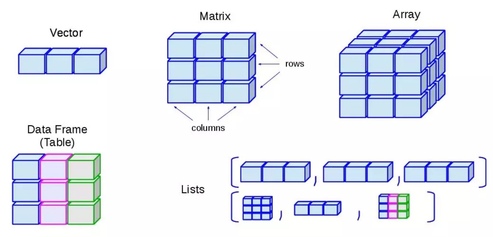
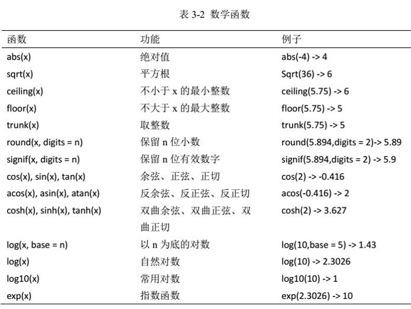
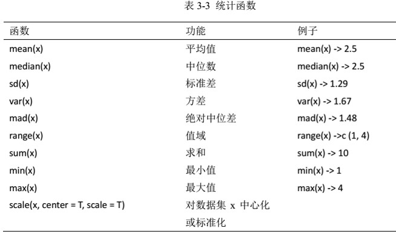

```{r setup, include=FALSE}
knitr::opts_chunk$set(collapse = TRUE, comment = '#>', fig.retina = 2, fig.align = 'center')
```

# 基本操作

```{r, eval=TRUE, echo=TRUE,message=FALSE}
library(tidyverse)
library(stringr)
library(lubridate)
library(nycflights13)
```

## R语言基本操作

你可以像使用计算器一样使用R：

```{r}
1 / 200 * 30
(59 + 73 + 2) / 3
2 ^ 2
sin(pi / 2)
```

你可以创建一个变量并使用`<-`进行赋值

```{r}
x <- 3 * 4
```

- 赋值操作的基本形式均为`object_name <- value`，`<-`在Rsudio中的快捷键是Alt + - 
- 你当然可以使用`=`进行赋值，但是**强烈不建议**
- **在Rstudio中使用Alt + Shift + K来显示所有可用的快捷键**


## R语言变量命名

- R语言中的变量名称必须以字母开头，并且只能包含字母，数字，下划线`_`以及`.`

- 为了让变量名更加有意义，往往需要多个单词，建议使用`_`进行分隔或者使用驼峰命名法

```{r, eval=FALSE}
i_use_snake_case
otherPeopleUseCamelCase
some.people.use.periods
And_aFew.People_RENOUNCEconvention
```

- 直接在R语言中输入变量名称来使用它

```{r}
x
```

## 数学运算符和向量

- 向量是数值的有序合集

```{r}
a <- c(1:5)
a
b <- c(5:9)
b
```

- 如果我们要将两个向量相加并得到一个新的向量：

```{r}
a + b
```

>- R里面几乎所有的运算符的都支持**向量化**操作
>- 如果两个向量长度不一样，会发生什么？ `c(1, 3, 6, 10, 15) + c(0, 1, 3, 6)`

## 向量化

在R语言中，向量化有几种含义：

- 运算符或者函数能够作用于向量中的每一个元素
- 当函数接收一个向量作为输入时，可以计算汇总统计
- 参数向量化

```{r, error=TRUE}
sum(1:5)
median(1:5)
sum(1, 2, 3, 4, 5)
median(1, 2, 3, 4, 5)
```

## 复杂数学运算

- 使用`?Syntax`来查看R语言支持的所有运算符
- 复杂计算：

$\int_0^{\infty}\frac{1}{(x + 1)\sqrt{x}}dx$

```{r, message=F, warning=F}
integrate(f = function(x){1 / ((x + 1) * sqrt(x))}, lower = 0, upper = Inf)
```

## 特殊数字

R语言支持四种特殊值：`-Inf`(负无穷), `Inf`(正无穷), `NaN`(非数字, Not A Number), `NA` (缺失值, Not Available)

```{r, warning=TRUE}
c(Inf + 1, Inf - 1, Inf - Inf)
c(1 / Inf, Inf / 1, Inf / Inf)
c(sqrt(Inf), sin(Inf))
c(NA + 1, NA * 5, NA + Inf)
```

同时，R语言也提供了4个函数来检查这些特殊值：

```{r}
is.finite(c(0, Inf, NA, NaN))
is.infinite(c(0, Inf, NA, NaN))
is.na(c(0, Inf, NA, NaN))
is.nan(c(0, Inf, NA, NaN))
```

## 逻辑向量

R里面有三种逻辑状态：`TRUE(T)`、`FALSE(F)`、`NA`

同时R也提供了三个向量化的逻辑运算符：

- `!`：代表非操作
- `&`：代表与操作
- `|`：代表或操作

```{r}
x <- c(T, F, NA)
xy <- expand.grid(x = x, y = x)
within(
  xy,
  {
    and <- x & y
    or <- x | y
    not.y <- !y
    not.x <- !x
    }
  )
```

>- R里面还有另外两个类似的操作符，`||`和`&&`，请自行查阅帮助。

## 数值判断

```{r, eval=TRUE, echo=TRUE}
# Compare numbers (==, >=, !=, <=, <, >)
# ?comprison
sqrt(2) ^ 2 == 2 # T or F?
all.equal(sqrt(2) ^ 2, 2) # if TRUE, it will return TRUE
# all.equal(sqrt(2), 3) # if FALSE, it will report the difference.
isTRUE(all.equal(sqrt(2), 3))
```
**比较数字是否相同，不要使用==，使用all.equal函数**。

# R语言数据类型

## 数据类型种类

R中所有的变量都有一个类，表明此变量属于什么类型。
在R中，最小的数据类型是原子向量（Atomic）

```{r, echo=FALSE}
library(purrr)
library(stringr)
apropos('^is\\.') %>%
  map_chr(~ str_split(.x, pattern = '\\.', simplify = T)[2]) %>%
  str_remove_all('\\<-') %>%
  unique()
```


## 数据类型判断

R里面也提供了大量的函数来判断数据类型。

```{r, echo=FALSE}
apropos('^is\\.')[1:50]
```

## 类型转换

R里面提供了很多的函数来进行数据类型的转换。

```{r, echo=FALSE}
apropos('^as\\.')[1:50]
```

# 几种重要的数据类型

## 数值

R里面所有的变量都有一个类，一般来说可以使用`class()`来获取某一对象的类型。

```{r}
class(1L)
class(1.5)
class(1 + 3i)
class(1 > 2)
```

## 字符和因子

- 字符

```{r}
class(c('male', 'female'))
```

- 因子

```{r}
gender <- factor(c('male', 'female'))
gender
```

因子和字符的唯一区别是因子有水平(`level`)属性。因子会按照水平进行排序。
可以使用`factor()`调整因子的水平。

>- 有一个数值型的因子，如何将它转为数值？ `a <- factor(c(1, 11, 20, 30))`
>- 提示：`as.numeric()`可以将字符转换成数字。

# R语言数据结构

## 数据结构分类

R语言有5种基本的数据结构，分别是：向量（vector）、矩阵（matrix）、
数组（array）、列表（list）和数据框（data.frame）

```{r, out.width='70%', fig.align='center', fig.cap='数据类型'}

```

# 向量

## 向量的定义
- 原子向量是用于存储数值型、字符型或逻辑型数据的**一维数组**。
- 通常使用`c()`来构建原子向量，`c()`是combine的简写。

```{r, eval=TRUE, echo=TRUE}
a <- c(1, 2, 5, 3, 6, -2, 4)  # numeric vector 
b <- c("one", "two", "three") # character vector
c <- c(TRUE, TRUE, TRUE)      # logical vector 
```

- **原子向量中的数据必须是相同的类型(数值型、字符型或逻辑型)。**

## 向量强制转换
- 当把不同类型的数据结合成一个向量时，它们会被强制转换（coerce）成灵活的类型
- 数据类型灵活性由低到高的排序为：`logical` < `integer` < `double` < `character`
- 逻辑性变量强制转换时，`TRUE`变成`1`，`FALSE`变成`0`。配合`sum()`和`mean()`使用

```{r, eval=TRUE, echo=TRUE}
x <- c(F, F, T)
sum(x) # Total number of TRUEs
mean(x) # Propotion that are TURE
```

## 创建重复的向量
```{r, eval=TRUE, echo=TRUE}
rep(2:5, 2) # rep(2:5, times = 2)
rep(1:3, times = 4, each = 2) 
paste('x', 1:5, sep = '_')
```

## 向量的基本操作 
```{r, eval=TRUE, echo=TRUE}
a <- 1:10
a[c(1, 3, 5)] # 1st, 3rd and 5th elements in a
a[a > 3] # list all the elements larger than 3 in a
a[-c(1:3)] # eliminate the first 3 elements in a
a * a # element-wise manipulation 
length(a) # the length of the vector
b <- c(apple = 1, banana = 2, 'kiwi fruit' = 3, 4)
b
```

# 矩阵（matrix）

## 矩阵的定义 
矩阵是一个**二维数组**。
```{r, eval=TRUE, echo=TRUE}
matrix(1:4, nrow = 2, ncol = 2) # a 2 by 2 matrix
matrix(1:4, nrow = 2, ncol = 2, byrow = T) # filled by rows
```

## 矩阵基本操作
```{r, eval=TRUE, echo=TRUE}
x <- matrix(1:6, 2, 3) 
x[2, 2] # element at 2nd row and 2nd column
x[2, ]  # all elements in 2nd row 
x[ ,2]  # all elements in 2nd column  
x[2, c(2, 3)]  # elements at 2nd and 3rd column in 2nd row 
```

# 列表

## 通用列表（list）
- R数据类型中最为复杂的一种数据结构。
- 列表就是包含**任何**类型的对象，可以是若干向量、矩阵、数据框，甚至其他列表的组合。
- 可以通过`list()`来创建
```{r, eval=TRUE, echo=TRUE}
char_obj <- "My First List" 
vec_obj <- c(25, 26, 18, 39) 
mat_obj <- matrix(1:10, nrow = 5) 
my_list <- list(char_obj, vec_obj, mat_obj)
my_list[[1]] # first element in a list
```

## 数据框（data.frame/data.table）
```{r, eval=TRUE, echo=TRUE}
mydata <- data.frame(patientID = c(1, 2, 3, 4),
                     age       = c(25, 34, 28, 52), 
                     diabetes  = c("Type1", "Type2","Type1","Type1"),
                     status    = c("Poor", "Improved", "Excellent", "Poor")
                     )
head(mydata, 3)
```
**数据库里的不同列的数据长度须一致，相同列的数据类型须一致**

R语言原生的data.table处理规模较大的数据时速度较慢，可以用data.table代替。后续课程会详细介绍。

# 在R语言中使用函数

## 函数调用

R语言中有大量的内置函数，同时也有大量的第三方程序包提供的函数，他们调用的方式都相同：

```{r, eval=FALSE}
function_name(arg1 = val1, arg2 = val2, ...)
```

我们尝试使用`seq()`来生成1到10的一个向量。

```{r}
x <- seq(1, 10)
x
```

## 循环和其他控制流程 （Control Flow）

- 语法

使用`?Control`来查看R支持的控制流程

```{r, eval=F}
for(var in seq) expr
while(cond) expr
repeat expr
```
```{r}
for (i in 1:5) {
  print(i)
}
```

## 循环的替代品-`*apply`函数

```{r}

A <- matrix(rnorm(18), 3, 6)
A
for (i in 1:ncol(A)){
  print(mean(A[, i]))
}

apply(A, 2, mean)
```

- 用`??apply`查看所有apply函数


## 常用数学函数

```{r, out.width='60%', fig.align='center', fig.cap='数学函数', echo=FALSE}

```

## 常用统计函数

```{r, out.width='60%', fig.align='center', fig.cap='统计函数', echo=FALSE}

```

# 数据挖掘

## 简单数据探索
```{r, eval=FALSE, echo=TRUE}
x <- rnorm(100, 0, 1)
summary(x)
boxplot(x, main = 'Box plot')
hist(x, 20, col = 'blue')
qqnorm(x)
```

```{r, eval=TRUE, echo=FALSE, out.width='32%', fig.align='default'}
x <- rnorm(100, 0, 1)
summary(x)
boxplot(x, main = 'Box plot')
hist(x, 20, col = 'blue')
qqnorm(x)
```

## 简单的统计分析

```{r, out.width='80%', message=FALSE}
library(data.table)
set.seed(12345)
random_dt <- data.table(weight = round(c(rnorm(10, 0, 1), rnorm(10, 2, 1)), 3),
                        group = rep(c('ctrl', 'case'), each = 10))
t.test(weight ~ group, random_dt)
```
