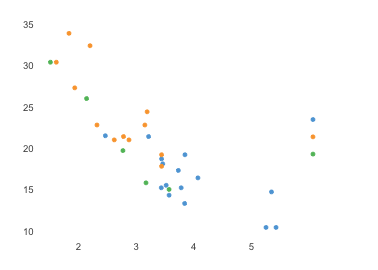
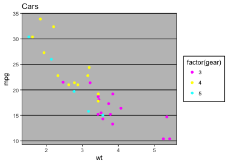

```{r setup, include=FALSE}
knitr::opts_chunk$set(collapse = TRUE, comment = '#>', fig.retina = 2, fig.align = 'center')
```

```{r, echo=FALSE, message=FALSE, warning=FALSE}
library(tidyverse)
library(purrr)
library(lubridate)
```

# ggplot基本用法

## 创建第一个`ggplot`

油耗（hwy）与排量之间的关系（displ）是怎样的？

```{r, fig.asp=0.6}
ggplot(data = mpg) + 
  geom_point(mapping = aes(x = displ, y = hwy))
```

## 基本语法和属性

```{r, eval=FALSE, highlight=TRUE}
ggplot(data = <DATA>) + 
  <GEOM_FUNCTION>(mapping = aes(<MAPPINGS>))
```

# 映射图形属性（Aesthetic mappings）

## 什么是映射

> “The greatest value of a picture is when it forces us to notice what we never expected to see.” — John Tukey

```{r, fig.asp=0.6, echo=FALSE, fig.align='default', out.width='48%'}
ggplot(data = mpg, mapping = aes(x = displ, y = hwy)) + 
  geom_point()
ggplot(data = mpg, mapping = aes(x = displ, y = hwy)) + 
  geom_point() +
  geom_point(data = filter(mpg, class == '2seater'), color = 'red') +
  geom_smooth(method = 'lm', se = F, color = 'blue')
```

- 这些离群的红点什么类型的汽车呢？

- 为了解决这个问题，我们可以引入第三个变量，并通过把它*映射*到某一图形属性（`aesthetic`）
- 图形属性包括点的大小、形状、颜色等等。不同的数值可以*映射*成不同的属性级别（`level`）

## 在`ggplot2`使用映射

- `ggplot()`使用`mapping`参数传递*映射*关系
- *映射*关系通过`aes()`函数进行构建，`aes()`是`aesthetic`的缩写

```{r, echo = FALSE, asp = 1/4, fig.height=2}
ggplot() +
  geom_point(aes(1, 1), size = 20) +
  geom_point(aes(2, 1), size = 10) + 
  geom_point(aes(3, 1), size = 20, shape = 17) + 
  geom_point(aes(4, 1), size = 20, colour = "blue") + 
  scale_x_continuous(NULL, limits = c(0.5, 4.5), labels = NULL) + 
  scale_y_continuous(NULL, limits = c(0.9, 1.1), labels = NULL) + 
  theme(aspect.ratio = 1/3)
```

::::::{.columns}
:::{.column}
- 回到刚才的问题，如果我们要看不同类别的车辆油耗与排量之间的区别，我们可以将`class`映射到点的形状（`shape`）或者颜色（`color`）上:
:::
:::{.column}
```{r, warning = FALSE, fig.asp = 1/2, fig.cap ="", echo=FALSE}
# Left
ggplot(data = mpg) + 
  geom_point(mapping = aes(x = displ, y = hwy, shape = class))

# Right
ggplot(data = mpg) + 
  geom_point(mapping = aes(x = displ, y = hwy, color = class))
```
:::
::::::

## 手动设置图形属性
```{r out.width = "50%", fig.align = 'default', warning = FALSE, fig.asp = 1/2, fig.cap ="", echo=FALSE}
# Left
ggplot(data = mpg) + 
  geom_point(mapping = aes(x = displ, y = hwy, color = class))

# Right
ggplot(data = mpg) + 
  geom_point(mapping = aes(x = displ, y = hwy), color = 'red')
```

> - `ggplot2`很强大，你把数据丢给他，设置好映射，选择好几何图形，剩下的它都会帮你搞定
> - 当然，我们可以手动设置图形属性
> - HOW? （Hint：`aes()`）
> - 只要把图形属性挪到`aes()`函数外就行了！
> - `ggplot(data = mpg) + geom_point(mapping = aes(x = displ, y = hwy), color = 'red')`

## 映射总结

- 映射是将数据特征表达成几何图形属性的过程
- `ggplot()`使用`mapping`参数传递映射关系
- 映射关系通过`aes()`函数进行构建，`aes()`是`aesthetic`的缩写
- `ggplot2`会根据数据自动计算映射的等级（`level`）
- 可以手动设置图形属性（把图形属性挪到`aes()`函数外）

## 分面（Facests） 

- 除了图形属性外，分面也可以很好的展示不同类型的变量
- `ggplot`中使用`facet_*`函数来进行分面
- 如果我们按照`class`进行分面:

```{r}
ggplot(data = mpg) + 
  geom_point(mapping = aes(x = displ, y = hwy)) + 
  facet_wrap(~ class, nrow = 2)
```

- 同样，我们可以对驱动方式和气缸数量进行分面(`facet_gird()`)
```{r}
ggplot(data = mpg) + 
  geom_point(mapping = aes(x = displ, y = hwy)) + 
  facet_grid(drv ~ cyl)
```

# 图形几何对象（Geometric objects）

## 什么是几何对象

```{r echo = FALSE, out.width = "48%", fig.align="default", message = FALSE}
ggplot(data = mpg) + 
  geom_point(mapping = aes(x = displ, y = hwy))

ggplot(data = mpg) + 
  geom_smooth(mapping = aes(x = displ, y = hwy))
```

- 以上两幅图的x轴相同，y轴也相同，所描述的数据也相同，但是两幅图存在明显差异
- 每幅图使用了不同的几何对象（Geometric objects）来描述
- 在`ggplot2`的语法中，我们可以说这两幅图用了不同的`geoms`

## `Geoms` (`geom_*`)

- 在`ggplot2`中，一个`geom`指的是用来描述数据的一种几何对象
- 不同的`geom`就代表了不同类型的图
- 在`ggplot2`中替换几何对象十分方便，只需要替换你加到`ggplot()`的`geom`函数，比如上图：
```{r eval = FALSE}
# left
ggplot(data = mpg) + 
  geom_point(mapping = aes(x = displ, y = hwy))

# right
ggplot(data = mpg) + 
  geom_smooth(mapping = aes(x = displ, y = hwy))
```
- `ggplot2`自带了40多种[`geoms`](http://rstudio.com/cheatsheets.)（还记得怎么查看吗，Hint:`apropos`）
```{r eval = TRUE, echo=FALSE}
apropos('^geom_')
```
- `apropos('^geom_')`

## `Geoms` (分组)

如果要分组展示不同的数据，怎么办

- 你可以在`aes()`中使用`group`参数 
- 将`group`设置为你想要的的分类变量即可

```{r, message=FALSE, fig.asp=0.6}
ggplot(data = mpg) +
  geom_smooth(mapping = aes(x = displ, y = hwy, group = drv))
```

## 在`ggplot2`中展示多个`geoms` 

- 如果要在一张图中展示多个`geoms`怎么办？
- 可以将多个`geom_*()`函数用`+`连接

```{r, fig.asp=0.6, message=FALSE}
ggplot(data = mpg) + 
  geom_point(mapping = aes(x = displ, y = hwy)) +
  geom_smooth(mapping = aes(x = displ, y = hwy))
```

## `mapping`继承

- 考虑一下刚刚那段代码：

```{r, eval=FALSE}
ggplot(data = mpg) + 
  geom_point(mapping = aes(x = displ, y = hwy)) +
  geom_smooth(mapping = aes(x = displ, y = hwy))
```

- 我们在`geom_point`和`geom_smooth`中分别指定了`mapping`，但是它们实际上是一样的

 - 为了简化代码，我们可以将**一系列相同的**的`mapping`传递给`ggplot()`，而后续增加的`geom_*()`会继承这些参数，除非你重新指定：
```{r, fig.asp=0.6, message=FALSE, out.width='70%'}
ggplot(data = mpg, mapping = aes(x = displ, y = hwy)) + 
  geom_point(aes(color = class)) +
  geom_smooth()
```
-  在`geom_*()`指定的`mapping`只会影响当前的`geom`行为

## `data`继承

- 除了`mapping`参数可以继承外，`data`也是可以继承的
- 如果你不指定新的`data`，所有后续的`geom_*()`都会继承相同的`data`
- 你可以在不同`geom_*()`使用不同的`data`
- 在`geom_*()`指定的`data`只会影响当前的`geom`行为

```{r, fig.asp=0.6, message=FALSE}
ggplot(data = mpg, mapping = aes(x = displ, y = hwy)) + 
  geom_point(mapping = aes(color = class)) + 
  geom_smooth(data = filter(mpg, class == "subcompact"), se = FALSE)
```

## `Geoms` 总结

- 在`ggplot2`中，一个`geom`指的是用来描述数据的一种几何对象
- 可以通过设置`group`参数，在不做映射的情况下分组绘制多个`geom`
- 用`+`连接连接多个`geom_*()`函数可以绘制多个几何图形
- `geom_*()`会继承`ggplot()`中的`data`和`mapping`参数
- 在`geom_*()`指定的`data`和`mapping`只会影响当前的`geom`行为

# 统计变换

## 什么是统计变换

- 柱形图(`geom_bar()`)

```{r, fig.asp=0.6, echo=TRUE, out.width='70%'}
ggplot(data = diamonds) + 
  geom_bar(mapping = aes(x = cut))
```

- 柱形图和之前的散点图有什么区别？
- 很多图形，如散点图，展示的数据本身，而有些图形，如柱形图，会计算新的变量并展示：
    - 柱形图、直方图等默认会将数据分组（bin）并统计每组内的数据数量
    - 平滑线会用模型拟合你的数据并展示预测数据
    - 箱形会统计数据分布并展示

## `stat_*()`

- `ggplot2`中用来进行统计变换的函数为`stat_*()`
- 下图展示了`geom_bar()`通过`stat_count()`进行统计变换的流程

```{r, out.width='48%', echo=FALSE}
  knitr::include_graphics('./Figures/visualization-stat-bar.png')
```

- 运行`?geom_bar`来查看其可以计算的统计量
- 你可以任意使用`stat_*()`和`geom_*()`来绘制相同的图形

```{r, fig.asp=0.6, echo=TRUE, out.width='48%'}
ggplot(data = diamonds) + 
  stat_count(mapping = aes(x = cut))
```

- 每种`geom`都有一个默认的`stat`，每种`stat`也都对应一个默认的`geom`

## 改变默认的统计变换 {.allowframebreaks}

- 假设你有如下一组数据：
```{r, echo=FALSE, fig.align='default', out.width='48%', fig.asp=0.6}
demo <- tribble(
  ~cut,         ~freq,
  "Fair",       1610,
  "Good",       4906,
  "Very Good",  12082,
  "Premium",    13791,
  "Ideal",      21551
)
demo
ggplot(data = demo) + 
  geom_bar(mapping = aes(x = cut)) +
  ggtitle('stat_count')
ggplot(data = demo) + 
  geom_bar(mapping = aes(x = cut, y = freq), stat = 'identity') +
  ggtitle('stat_identity')
```

- 如何得到每种类别所占的比例？(`prop`)
- `vignette("ggplot2-specs")`
- `?geom_bar`

```{r, fig.asp=0.6}
ggplot(data = diamonds) + 
  geom_bar(mapping = aes(x = cut, y = ..prop.., group = 1))
```

## 更复杂的统计 {.allowframebreaks}

- `ggplot2`提供了30种统计变换函数：

```{r, echo=F}
apropos('^stat_')
```

- `stat_summary()`描述每个x对应的y特征

```{r, fig.asp=0.6}
ggplot(data = diamonds) + 
  stat_summary(
    mapping = aes(x = cut, y = depth),
    fun.ymin = min,
    fun.ymax = max,
    fun.y = median
  )
```

## 统计变换总结

- `ggplot2`中用来进行统计变换的函数为`stat_*()`
- 每种`geom`都有一个默认的`stat`，每种`stat`也都对应一个默认的`geom`
- `ggplot2`提供了30种统计变换函数
- 你可以任意使用`stat_*()`和`geom_*()`来绘制相同的图形

# 图形位置（`position_*`）

## 如何调整图形的位置 {.allowframebreaks}

- 如何展示不同clarity的钻石在不同cut中数量？
```{r, fig.asp=0.6}
ggplot(data = diamonds) +
  geom_bar(mapping = aes(x = cut, fill = clarity), position = 'stack')
```

- 如果你不想要堆积（stack）柱状图，你可以尝试以下4种位置参数：
    - `position = 'fill'`
    - `position = 'dodge'`
    - `position = 'dodge2'`
    - `position = 'identity'`

```{r, fig.asp=0.6, out.width='48%', echo=FALSE, fig.align='default'}
ggplot(data = diamonds) +
  geom_bar(mapping = aes(x = cut, fill = clarity), position = 'fill') +
  ggtitle('fill')
ggplot(data = diamonds) +
  geom_bar(mapping = aes(x = cut, fill = clarity), position = 'dodge') +
  ggtitle('dodge')
```

```{r, fig.asp=0.6, out.width='48%', echo=FALSE, fig.align='default'}
ggplot(data = diamonds) +
  geom_bar(mapping = aes(x = cut, fill = clarity), position = 'dodge2') +
  ggtitle('dodge2')
ggplot(data = diamonds) +
  geom_bar(mapping = aes(x = cut, fill = clarity), position = 'identity') +
  ggtitle('identity')
```

## 散点图的位置调整 {.allowframebreaks}

- 还记得第一张散点图吗？

```{r, fig.asp=0.6, echo=FALSE}
ggplot(data = mpg) + 
  geom_point(mapping = aes(x = displ, y = hwy))
```

- 我们的原始数据有234个，但是上图仅显示了126个点，还有109个点去哪里了

- 它们重叠了（overplotted）

- 可以采用`position = 'jitter'`来改善这个问题 

```{r, fig.asp=0.6, echo=TRUE}
ggplot(data = mpg) + 
  geom_point(mapping = aes(x = displ, y = hwy), position = 'jitter')
```

## 位置调整总结

- `ggplot2`提供了一系列位置调整的函数

```{r, echo=FALSE}
apropos('^position_')
```

- 当你的图形重叠（overplotted）时，可以使用`position = 'jitter'`来进行调整

# 坐标系统 (`coord_*`)

## 什么是坐标系统

- 坐标系统是`ggplot2`中最为复杂的组件

- `ggplot2`中的坐标系统通过`coord_*`函数进行控制

- `ggplot2`中提供的坐标系统有：

```{r, echo=F}
apropos('^coord_')
```

**默认的坐标系为笛卡尔坐标系`coord_cartesian()`**

## coord_flip()

- `coord_flip()`用来翻转x和y轴

```{r, echo=TRUE, eval=FALSE}
ggplot(data = mpg, mapping = aes(x = class, y = hwy)) + 
  geom_boxplot()
ggplot(data = mpg, mapping = aes(x = class, y = hwy)) + 
  geom_boxplot() +
  coord_flip()
```

```{r, fig.asp=0.6, out.width='48%', echo=FALSE, fig.align='default'}
ggplot(data = mpg, mapping = aes(x = class, y = hwy)) + 
  geom_boxplot() + 
  labs(title = 'without flip')
  
ggplot(data = mpg, mapping = aes(x = class, y = hwy)) + 
  geom_boxplot() +
  coord_flip() +
  labs(title = 'with flip')
```

## coord_quickmap()

- `coord_quickmap()`可以用来展示空间数据，如地图等，会自动调整x轴和y轴的比例

```{r, echo=TRUE, eval=FALSE}
nz <- map_data("nz")

ggplot(nz, aes(long, lat, group = group)) +
  geom_polygon(fill = "white", colour = "black")

ggplot(nz, aes(long, lat, group = group)) +
  geom_polygon(fill = "white", colour = "black") +
  coord_quickmap()
```

```{r, fig.asp=0.6, out.width='48%', echo=FALSE, fig.align='default'}
nz <- map_data("nz")

ggplot(nz, aes(long, lat, group = group)) +
  geom_polygon(fill = "white", colour = "black") +
  labs(title = 'with quickmap')

ggplot(nz, aes(long, lat, group = group)) +
  geom_polygon(fill = "white", colour = "black") +
  coord_quickmap() +
  labs(title = 'without quickmap')
```

## coord_polar()

- `coord_polar()`用来画极坐标

```{r, echo=TRUE, eval=FALSE}
bar <- ggplot(data = diamonds) + 
  geom_bar(
    mapping = aes(x = cut, fill = cut), 
    show.legend = FALSE,
    width = 1
  ) + 
  theme(aspect.ratio = 1) +
  labs(x = NULL, y = NULL)

bar + coord_flip()
bar + coord_polar()
```

```{r, fig.asp=0.6, out.width='48%', echo=FALSE, fig.align='default'}
bar <- ggplot(data = diamonds) + 
  geom_bar(
    mapping = aes(x = cut, fill = cut), 
    show.legend = FALSE,
    width = 1
  ) + 
  theme(aspect.ratio = 1) +
  labs(x = NULL, y = NULL)

bar + coord_flip() + labs(title = 'coord_flip')
bar + coord_polar() + labs(title = 'coord_polar')
```

# 标度系统

## 什么是标度系统

- 标度系统是一组将数据空间转换成几何空间的函数
- `ggplot2`中提供了一系列标度函数，均以`scale_`开头
- 默认的标度函数有：

```{r, echo=FALSE}
apropos('^scale_')[1:50]
```

## 默认标度

当你写下：

```{r, eval=FALSE}
ggplot(mpg, aes(displ, hwy)) + 
  geom_point(aes(colour = class))
```

实际上`ggplot2`会帮你添加一系列默认的标度函数：

```{r, eval=FALSE}
ggplot(mpg, aes(displ, hwy)) + 
  geom_point(aes(colour = class)) +
  scale_x_continuous() + 
  scale_y_continuous() + 
  scale_colour_discrete()
```

## 调整默认标度

你可以通过改变标度函数中的默认值来改变标度函数，如：

```{r, eval=FALSE}
ggplot(mpg, aes(displ, hwy)) + 
  geom_point() + 
  scale_x_continuous("Label 2")
```

你也可以更换使用不同的标度函数，如：

```{r, eval=FALSE}
ggplot(mpg, aes(displ, hwy)) + 
  geom_point(aes(colour = class)) +
  scale_x_sqrt() + 
  scale_colour_brewer()
```

## 图例

- `ggplot2`中图例和坐标轴统称为**guides**

```{r, echo=FALSE, out.width='80%'}
knitr::include_graphics('Figures/ggplot2_guides.png')
```

- 可以采用`guide_legend()`来修改图例的样式和内容

```{r, eval=FALSE}
base <- ggplot(mpg, aes(drv, fill = factor(cyl))) + geom_bar() 

base
base + guides(fill = guide_legend(ncol = 2))
base + guides(fill = guide_legend(ncol = 2, byrow = TRUE))
```

## `override.aes`

- 当你的图例需要和图中显示不一样的时候，`override.aes`很有用！

```{r, eval=FALSE}
base <- ggplot(mpg, aes(displ, hwy, colour = drv)) +
  geom_point(size = 4, alpha = .2, stroke = 0)

base + guides(colour = guide_legend())
base + guides(colour = guide_legend(override.aes = list(alpha = 1)))
```


```{r, out.width='45%', fig.align='default', echo=FALSE}
base <- ggplot(mpg, aes(displ, hwy, colour = drv)) +
  geom_point(size = 4, alpha = .2, stroke = 0)

base + guides(colour = guide_legend())
base + guides(colour = guide_legend(override.aes = list(alpha = 1)))
```

# 主题

## `theme()`

- 主题可以用来调整图中的非数据元素（如：标题、标签、字体、背景、图例等等）
- `ggplot`提供了一系列内置的主题函数
- 可以使用`theme()`函数来自定义自己的主题
- 有大量的第三方包提供了精美的配色主题

```{r, echo=FALSE}
args(ggplot2::theme)
```

## 第三方主题包

```{r, echo=FALSE, out.width="25%", fig.align='default'}

knitr::include_graphics('./Figures/calc-1.png')
knitr::include_graphics('./Figures/economist-1.png')

knitr::include_graphics('./Figures/excel2-1.png')
knitr::include_graphics('./Figures/fivethirtyeight-1.png')
knitr::include_graphics('./Figures/gdocs-1.png')
knitr::include_graphics('./Figures/solarized-alt-1.png')
knitr::include_graphics('./Figures/pander-scatterplot-1.png')
knitr::include_graphics('./Figures/paultol-barplot-1.png')
knitr::include_graphics('./Figures/tableau-colorbind10-1.png')
knitr::include_graphics('./Figures/stata-1.png')
```
# 总结

## 图层语法

```{r, eval=F}
ggplot(data = <DATA>) + 
  <GEOM_FUNCTION>(
     mapping = aes(<MAPPINGS>),
     stat = <STAT>, 
     position = <POSITION>
  ) +
  <COORDINATE_FUNCTION> +
  <FACET_FUNCTION>
```

- 实际上，你只需要提供data，mapping和geom，其他的参数ggplot2都能用它的默认值帮你搞定

- 通过数据、几何图形、映射、统计变换、位置调整、坐标系调整以及分面，理论上你可以画出任何你想要的图片


```{r echo = FALSE, fig.asp=0.6, out.width = "30%", fig.align = "default", message = FALSE}
ggplot(mpg, aes(x = displ, y = hwy))
ggplot(mpg, aes(x = displ, y = hwy)) + 
  geom_point(shape = 1) + 
  ggthemes::theme_map()
ggplot(mpg, aes(x = displ, y = hwy)) + 
  geom_point(aes(color = class)) + 
  ggthemes::theme_map() +
  scale_color_discrete(guide = F)
ggplot(mpg, aes(x = displ, y = hwy)) + 
  geom_smooth(se = F) + 
  ggthemes::theme_map()
ggplot(mpg, aes(x = displ, y = hwy)) +
  geom_point(aes(color = class)) +
  geom_smooth(se = F)
```

# 进阶绘图技巧

## patchwork多图组合

要在R中实现一页放多个图，一般使用`gridExtra`包中的`grid.arrange`函数或者`cowplot`包中的`plot_grid`函数，但是近日Thomas Lin Pedersen又出新作，颠覆了在`ggplot2`乃至基本包中实现一页多图的最佳方案

```{r, echo=FALSE, out.width='80%'}
knitr::include_graphics('./Figures/patchwork.png')
```

## patchwork基本用法

`patchwork`的使用非常简单，只需要将你需要组合的图像用`+`连接。

```{r, out.width='60%'}
library(ggplot2)
library(patchwork)

p1 <- ggplot(mtcars) + geom_point(aes(mpg, disp))
p2 <- ggplot(mtcars) + geom_boxplot(aes(gear, disp, group = gear))

p1 + p2
```

## patchwork进阶排版

`patchwork`为任意复杂的布局提供了丰富的支持。请看这个非常易读的代码，它将三个图形嵌套在第四个图形之上:


```{r, out.width='80%'}
p3 <- ggplot(mtcars) + geom_smooth(aes(disp, qsec))
p4 <- ggplot(mtcars) + geom_bar(aes(carb))

(p1 | p2 | p3) /
      p4
```

## patchwork个性化

### 标题

```{r, out.width='80%'}
patchwork <- (p1 + p2) / p3
patchwork + plot_annotation(
  title = 'The surprising truth about mtcars',
  subtitle = 'These 3 plots will reveal yet-untold secrets about our beloved data-set',
  caption = 'Disclaimer: None of these plots are insightful'
)
```

## patchwork个性化

### 标签

```{r, out.width='80%'}
patchwork + plot_annotation(tag_levels = 'A')
```

## patchwork个性化

### 主题

- 和`ggplot`有一点区别，在使用`patchwork`时，应该使用`&`来连接`theme()`函数

```{r, out.width='80%'}
patchwork & theme_bw()
```

## 控制布局

### 增加空位

```{r, echo=FALSE}
library(ggplot2)
p1 <- ggplot(mtcars) + 
  geom_point(aes(mpg, disp)) + 
  ggtitle('Plot 1')

p2 <- ggplot(mtcars) + 
  geom_boxplot(aes(gear, disp, group = gear)) + 
  ggtitle('Plot 2')

p3 <- ggplot(mtcars) + 
  geom_point(aes(hp, wt, colour = mpg)) + 
  ggtitle('Plot 3')

p4 <- ggplot(mtcars) + 
  geom_bar(aes(gear)) + 
  facet_wrap(~cyl) + 
  ggtitle('Plot 4')
```


```{r, out.width="60%"}
p1 + plot_spacer() + p2 + plot_spacer() + p3 + plot_spacer()
```

## 控制布局

### 控制网格

- 使用`plot_layout()`函数

```{r, out.width="80%"}
p1 + p2 + p3 + p4 + 
  plot_layout(widths = c(2, 1))
```

## 控制图例

### 使用`guides = 'collect'`

```{r, out.width="80%"}
p1 + p2 + p3 + p4 +
  plot_layout(guides = 'collect')
```

## 控制图例

### 使用`guide_area()`控制图例的位置

```{r, out.width="80%"}
p1 + p2 + p3 + guide_area() + 
  plot_layout(guides = 'collect')
```

## `ggplot-extension`

- [`ggplot-extension`](https://github.com/topics/ggplot-extension)
- [`gganimate` (A Grammar of Animated Graphics)](https://github.com/thomasp85/gganimate)
- [`hrbrthemes` (Additional Themes)](https://github.com/hrbrmstr/hrbrthemes)
- [`ggsignif` (Significance Brackets for `ggplot2`)](https://github.com/const-ae/ggsignif)
- [`ggnetwork` (Geometries to Plot Networks with `ggplot2`)](https://github.com/briatte/ggnetwork)
- [`ggfortify` (Data Visualization Tools for Statistical Analysis Results)](https://github.com/sinhrks/ggfortify)
- [`GGally` (Extension to `ggplot2`)](https://github.com/cran/GGally)
