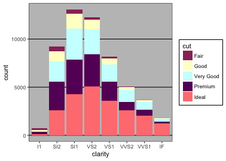
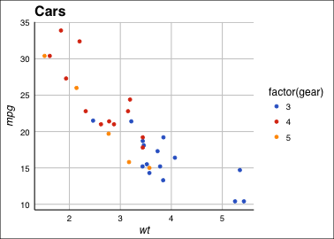
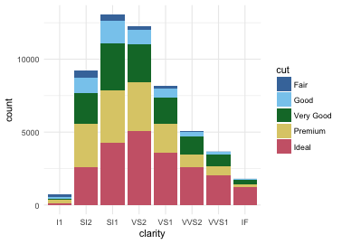

```{r setup, include=FALSE}
knitr::opts_chunk$set(echo = TRUE, warning = FALSE, 
                      message = FALSE, comment = '#>',
                      fig.align = 'center')
```

# 基本操作

```{r, eval=TRUE, echo=TRUE,message=FALSE}
library(tidyverse)
library(stringr)
library(lubridate)
library(nycflights13)
```

## R语言基本操作

你可以像使用计算器一样使用R：

```{r}
1 / 200 * 30
(59 + 73 + 2) / 3
2 ^ 2
sin(pi / 2)
```

你可以创建一个变量并使用`<-`进行赋值

```{r}
x <- 3 * 4
```

- 赋值操作的基本形式均为`object_name <- value`，`<-`在Rsudio中的快捷键是Alt + - 
- 你当然可以使用`=`进行赋值，但是**强烈不建议**
- **在Rstudio中使用Alt + Shift + K来显示所有可用的快捷键**


## R语言变量命名

- R语言中的变量名称必须以字母开头，并且只能包含字母，数字，下划线`_`以及`.`

- 为了让变量名更加有意义，往往需要多个单词，建议使用`_`进行分隔或者使用驼峰命名法

```{r, eval=FALSE}
i_use_snake_case
otherPeopleUseCamelCase
some.people.use.periods
And_aFew.People_RENOUNCEconvention
```

- 直接在R语言中输入变量名称来使用它

```{r}
x
```

## 数学运算符和向量

- 向量是数值的有序合集

```{r}
a <- c(1:5)
a
b <- c(5:9)
b
```

- 如果我们要将两个向量相加并得到一个新的向量：

```{r}
a + b
```

>- R里面几乎所有的运算符的都支持**向量化**操作
>- 如果两个向量长度不一样，会发生什么？ `c(1, 3, 6, 10, 15) + c(0, 1, 3, 6)`

## 向量化

在R语言中，向量化有几种含义：

- 运算符或者函数能够作用于向量中的每一个元素
- 当函数接收一个向量作为输入时，可以计算汇总统计
- 参数向量化

```{r, error=TRUE}
sum(1:5)
median(1:5)
sum(1, 2, 3, 4, 5)
median(1, 2, 3, 4, 5)
```

## 复杂数学运算

- 使用`?Syntax`来查看R语言支持的所有运算符
- 复杂计算：

$\int_0^{\infty}\frac{1}{(x + 1)\sqrt{x}}dx$

```{r, message=F, warning=F}
integrate(f = function(x){1 / ((x + 1) * sqrt(x))}, lower = 0, upper = Inf)
```

## 特殊数字

R语言支持四种特殊值：`-Inf`(负无穷), `Inf`(正无穷), `NaN`(非数字, Not A Number), `NA` (缺失值, Not Available)

```{r, warning=TRUE}
c(Inf + 1, Inf - 1, Inf - Inf)
c(1 / Inf, Inf / 1, Inf / Inf)
c(sqrt(Inf), sin(Inf))
c(NA + 1, NA * 5, NA + Inf)
```

同时，R语言也提供了4个函数来检查这些特殊值：

```{r}
is.finite(c(0, Inf, NA, NaN))
is.infinite(c(0, Inf, NA, NaN))
is.na(c(0, Inf, NA, NaN))
is.nan(c(0, Inf, NA, NaN))
```

## 逻辑向量

R里面有三种逻辑状态：`TRUE(T)`、`FALSE(F)`、`NA`

同时R也提供了三个向量化的逻辑运算符：

- `!`：代表非操作
- `&`：代表与操作
- `|`：代表或操作

```{r}
x <- c(T, F, NA)
xy <- expand.grid(x = x, y = x)
within(
  xy,
  {
    and <- x & y
    or <- x | y
    not.y <- !y
    not.x <- !x
    }
  )
```

>- R里面还有另外两个类似的操作符，`||`和`&&`，请自行查阅帮助。

## 数值判断

```{r, eval=TRUE, echo=TRUE}
# Compare numbers (==, >=, !=, <=, <, >)
# ?comprison
sqrt(2) ^ 2 == 2 # T or F?
all.equal(sqrt(2) ^ 2, 2) # if TRUE, it will return TRUE
# all.equal(sqrt(2), 3) # if FALSE, it will report the difference.
isTRUE(all.equal(sqrt(2), 3))
```
**比较数字是否相同，不要使用==，使用all.equal函数**。

# R语言数据类型

## 数据类型种类

R中所有的变量都有一个类，表明此变量属于什么类型。
在R中，最小的数据类型是原子向量（Atomic）

```{r, echo=FALSE}
library(purrr)
library(stringr)
apropos('^is\\.') %>%
  map_chr(~ str_split(.x, pattern = '\\.', simplify = T)[2]) %>%
  str_remove_all('\\<-') %>%
  unique()
```


## 数据类型判断

R里面也提供了大量的函数来判断数据类型。

```{r, echo=FALSE}
apropos('^is\\.')[1:50]
```

## 类型转换

R里面提供了很多的函数来进行数据类型的转换。

```{r, echo=FALSE}
apropos('^as\\.')[1:50]
```

# 几种重要的数据类型

## 数值

R里面所有的变量都有一个类，一般来说可以使用`class()`来获取某一对象的类型。

```{r}
class(1L)
class(1.5)
class(1 + 3i)
class(1 > 2)
```

## 字符和因子

- 字符

```{r}
class(c('male', 'female'))
```

- 因子

```{r}
gender <- factor(c('male', 'female'))
gender
```

因子和字符的唯一区别是因子有水平(`level`)属性。因子会按照水平进行排序。
可以使用`factor()`调整因子的水平。

>- 有一个数值型的因子，如何将它转为数值？ `a <- factor(c(1, 11, 20, 30))`
>- 提示：`as.numeric()`可以将字符转换成数字。

# R语言数据结构

## 数据结构分类

R语言有5种基本的数据结构，分别是：向量（vector）、矩阵（matrix）、
数组（array）、列表（list）和数据框（data.frame）

```{r, out.width='70%', fig.align='center', fig.cap='数据类型'}
knitr::include_graphics('./Figures/data_type.jpg')
```

# 向量

## 向量的定义
- 原子向量是用于存储数值型、字符型或逻辑型数据的**一维数组**。
- 通常使用`c()`来构建原子向量，`c()`是combine的简写。

```{r, eval=TRUE, echo=TRUE}
a <- c(1, 2, 5, 3, 6, -2, 4)  # numeric vector 
b <- c("one", "two", "three") # character vector
c <- c(TRUE, TRUE, TRUE)      # logical vector 
```

- **原子向量中的数据必须是相同的类型(数值型、字符型或逻辑型)。**

## 向量强制转换
- 当把不同类型的数据结合成一个向量时，它们会被强制转换（coerce）成灵活的类型
- 数据类型灵活性由低到高的排序为：`logical` < `integer` < `double` < `character`
- 逻辑性变量强制转换时，`TRUE`变成`1`，`FALSE`变成`0`。配合`sum()`和`mean()`使用

```{r, eval=TRUE, echo=TRUE}
x <- c(F, F, T)
sum(x) # Total number of TRUEs
mean(x) # Propotion that are TURE
```

## 创建重复的向量
```{r, eval=TRUE, echo=TRUE}
rep(2:5, 2) # rep(2:5, times = 2)
rep(1:3, times = 4, each = 2) 
paste('x', 1:5, sep = '_')
```

## 向量的基本操作 
```{r, eval=TRUE, echo=TRUE}
a <- 1:10
a[c(1, 3, 5)] # 1st, 3rd and 5th elements in a
a[a > 3] # list all the elements larger than 3 in a
a[-c(1:3)] # eliminate the first 3 elements in a
a * a # element-wise manipulation 
length(a) # the length of the vector
b <- c(apple = 1, banana = 2, 'kiwi fruit' = 3, 4)
b
```

# 矩阵（matrix）

## 矩阵的定义 
矩阵是一个**二维数组**。
```{r, eval=TRUE, echo=TRUE}
matrix(1:4, nrow = 2, ncol = 2) # a 2 by 2 matrix
matrix(1:4, nrow = 2, ncol = 2, byrow = T) # filled by rows
```

## 矩阵基本操作
```{r, eval=TRUE, echo=TRUE}
x <- matrix(1:6, 2, 3) 
x[2, 2] # element at 2nd row and 2nd column
x[2, ]  # all elements in 2nd row 
x[ ,2]  # all elements in 2nd column  
x[2, c(2, 3)]  # elements at 2nd and 3rd column in 2nd row 
```

# 列表

## 通用列表（list）
- R数据类型中最为复杂的一种数据结构。
- 列表就是包含**任何**类型的对象，可以是若干向量、矩阵、数据框，甚至其他列表的组合。
- 可以通过`list()`来创建
```{r, eval=TRUE, echo=TRUE}
char_obj <- "My First List" 
vec_obj <- c(25, 26, 18, 39) 
mat_obj <- matrix(1:10, nrow = 5) 
my_list <- list(char_obj, vec_obj, mat_obj)
my_list[[1]] # first element in a list
```

## 数据框（data.frame/data.table）
```{r, eval=TRUE, echo=TRUE}
mydata <- data.frame(patientID = c(1, 2, 3, 4),
                     age       = c(25, 34, 28, 52), 
                     diabetes  = c("Type1", "Type2","Type1","Type1"),
                     status    = c("Poor", "Improved", "Excellent", "Poor")
                     )
head(mydata, 3)
```
**数据库里的不同列的数据长度须一致，相同列的数据类型须一致**

R语言原生的data.table处理规模较大的数据时速度较慢，可以用data.table代替。后续课程会详细介绍。

# 在R语言中使用函数

## 函数调用

R语言中有大量的内置函数，同时也有大量的第三方程序包提供的函数，他们调用的方式都相同：

```{r, eval=FALSE}
function_name(arg1 = val1, arg2 = val2, ...)
```

我们尝试使用`seq()`来生成1到10的一个向量。

```{r}
x <- seq(1, 10)
x
```

## 循环和其他控制流程 （Control Flow）

- 语法

使用`?Control`来查看R支持的控制流程

```{r, eval=F}
for(var in seq) expr
while(cond) expr
repeat expr
```
```{r}
for (i in 1:5) {
  print(i)
}
```

## 循环的替代品-`*apply`函数

```{r}

A <- matrix(rnorm(18), 3, 6)
A
for (i in 1:ncol(A)){
  print(mean(A[, i]))
}

apply(A, 2, mean)
```

- 用`??apply`查看所有apply函数


## 常用数学函数

```{r, out.width='60%', fig.align='center', fig.cap='数学函数', echo=FALSE}
knitr::include_graphics('./Figures/math_function.jpg')
```

## 常用统计函数

```{r, out.width='60%', fig.align='center', fig.cap='统计函数', echo=FALSE}
knitr::include_graphics('./Figures/stat_function.jpg')
```

# 数据挖掘

## 简单数据探索
```{r, eval=FALSE, echo=TRUE}
x <- rnorm(100, 0, 1)
summary(x)
boxplot(x, main = 'Box plot')
hist(x, 20, col = 'blue')
qqnorm(x)
```

```{r, eval=TRUE, echo=FALSE, out.width='32%', fig.align='default'}
x <- rnorm(100, 0, 1)
summary(x)
boxplot(x, main = 'Box plot')
hist(x, 20, col = 'blue')
qqnorm(x)
```

## 简单的统计分析

```{r, out.width='80%', message=FALSE}
library(data.table)
set.seed(12345)
random_dt <- data.table(weight = round(c(rnorm(10, 0, 1), rnorm(10, 2, 1)), 3),
                        group = rep(c('ctrl', 'case'), each = 10))
t.test(weight ~ group, random_dt)
```

# 函数（Function）


## 为什么要使用函数

- 避免复制（do not repeat yourself）

```{r, echo=FALSE}
library(purrr)
library(tidyverse)
```


```{r, echo=TRUE, eval=FALSE}
df <- tibble::tibble(
  a = rnorm(10),
  b = rnorm(10),
  c = rnorm(10),
  d = rnorm(10)
)

df$a <- (df$a - min(df$a, na.rm = TRUE)) / 
  (max(df$a, na.rm = TRUE) - min(df$a, na.rm = TRUE))
df$b <- (df$b - min(df$b, na.rm = TRUE)) / 
  (max(df$b, na.rm = TRUE) - min(df$a, na.rm = TRUE))
df$c <- (df$c - min(df$c, na.rm = TRUE)) / 
  (max(df$c, na.rm = TRUE) - min(df$c, na.rm = TRUE))
df$d <- (df$d - min(df$d, na.rm = TRUE)) / 
  (max(df$d, na.rm = TRUE) - min(df$d, na.rm = TRUE))
```

- 以上代码的作用是将`df`里的每一列标准化到0和1之间
- 但是复制的时候出错了（`df$b`）
- 如何有效避免此类问题？

## 将重复的工作转化为函数

- 观察以下代码

```{r, echo=TRUE, eval=FALSE}
(df$a - min(df$a, na.rm = TRUE)) /
  (max(df$a, na.rm = TRUE) - min(df$a, na.rm = TRUE))
```

- 我们需要几个参数？
- 还能不能再做精简？（毕竟我们计算了3次最大最小值）

```{r}
rescale01 <- function(x) {
  rng <- range(x, na.rm = TRUE)
  (x - rng[1]) / (rng[2] - rng[1])
}
rescale01(c(0, 5, 10))
```

## 创建函数

- 选择一个合适的函数名（往往这个是最难的）
- 在`function()`里填入你的参数名（同样要取一个合适的名字）
- 在函数体中填入你的代码（`function(...){}`）
- 可以先将流程写好，然后将代码转换成函数
- 写完函数后，对不同参数进行测试！

```{r}
rescale01(c(-10, 0, 10))
rescale01(c(1, 2, 3, NA, 5))
```

## 使用函数

再回到我们原来的问题，我们现在可以对每一列使用函数

```{r, eval=FALSE}
df$a <- rescale01(df$a)
df$b <- rescale01(df$b)
df$c <- rescale01(df$c)
df$d <- rescale01(df$d)
```

同时，如果要修改代码，我们只需在函数体中修改一处即可。

- 有效避免了复制粘贴的错误
- 这样就完美了吗?

## 函数命名

- 函数尽量使用动词
- 可以使用`_`来连接多个单词，或者使用驼峰命名法，但是尽可能保持一致
- 多用注释！(Ctrl+shift+R)

```{r, eval=F}
# Good
input_select()
input_checkbox()
input_text()
impute_missing()
collapse_years()
# Don't do this!
T <- FALSE
c <- 10
mean <- function(x) sum(x)
# Never do this!
col_mins <- function(x, y) {}
rowMaxes <- function(y, x) {}
```

# 特殊函数

## 分支函数

- 使用`if`语句来构建函数分支

```{r, eval=FALSE}
if (condition) {
  # code executed when condition is TRUE
} else {
  # code executed when condition is FALSE
}
```

- 使用`if-else`或者`switch`构建多分支

```{r, eval=FALSE}
if (this) {
  # do that
} else if (that) {
  # do something else
} else {
  # 
}

manipulate_numbers <- function(x, y, op) {
  switch(op,
         plus = x + y,
         minus = x - y,
         times = x * y,
         divide = x / y,
         stop("Unknown op!")
  )
}
```

## 分支函数练习

- 编写一个名为`has_name`的函数，接收一个向量作为参数，返回这个向量中每个元素是否有名称。

```{r, echo=F}
has_name <- function(x) {
  nms <- names(x)
  if (is.null(nms)) {
    rep(FALSE, length(x))
  } else {
    !is.na(nms) & nms != ""
  }
}
```

```{r}
x <- 1:5
names(x) <- c("a", "b", NA, "d", "e")
has_name(x)
```

- `if`和`ifelse`的区别是啥，请举例说明
- 用`cut`改写以下函数

```{r, eval=F}
if (temp <= 0) {
  "freezing"
} else if (temp <= 10) {
  "cold"
} else if (temp <= 20) {
  "cool"
} else if (temp <= 30) {
  "warm"
} else {
  "hot"
}
```

## Dot-dot-dot (…)

-用`...`传递任意参数

```{r}
commas <- function(...) stringr::str_c(..., collapse = ", ")
commas(letters[1:10])

rule <- function(..., pad = "-") {
  title <- paste0(...)
  width <- getOption("width") - nchar(title) - 5
  cat(title, " ", stringr::str_dup(pad, width), "\n", sep = "")
}
rule("Important output")
```

# 返回值

## 函数返回值

- 显式返回值和隐式返回值
- R默认会隐式返回你函数体中最后一步运算表达式的结果（不需要显示调用`return()`）
- 如果要提前返回值，则应该考虑2点：

- 提早返回值会使你的代码更加清晰吗？
- 你的函数是否可以使用管道运算符？

## 显式返回

- 使得程序更加清晰

```{r, eval=FALSE}
complicated_function <- function(x, y, z) {
  if (length(x) == 0 || length(y) == 0) {
    return(0)
  }
    
  # Complicated code here
}

f <- function() {
  if (!x) {
    return(something_short)
  }

  # Do 
  # something
  # that
  # takes
  # many
  # lines
  # to
  # express
}
```

## 管道化操作

>Little bunny Foo Foo

>Went hopping through the forest

>Scooping up the field mice

>And bopping them on the head


```{r, eval=FALSE}
bop(
  scoop(
    hop(foo_foo, through = forest),
    up = field_mice
  ), 
  on = head
)

foo_foo %>%
  hop(through = forest) %>%
  scoop(up = field_mice) %>%
  bop(on = head)
```


## 编写可以使用管道运算的函数

- 在使用函数副作用时，用`invisible()`返回

```{r, eval=FALSE}
show_missings <- function(df) {
  n <- sum(is.na(df))
  cat("Missing values: ", n, "\n", sep = "")
  invisible(df)
}

mtcars %>% 
  show_missings() %>% 
  mutate(mpg = ifelse(mpg < 20, NA, mpg)) %>% 
  show_missings() 
```

# 迭代（Iteration） 

## 迭代用途

- 考虑下面的例子：
```{r}
library(tibble)
set.seed(1234)
df <- tibble(
  a = rnorm(10),
  b = rnorm(10),
  c = rnorm(10),
  d = rnorm(10)
)
median(df$a)
median(df$b)
median(df$c)
median(df$d)
```

- 如何用循环做？

## For循环

- 考虑下面的例子：
```{r}
set.seed(1234)
df <- tibble(
  a = rnorm(10),
  b = rnorm(10),
  c = rnorm(10),
  d = rnorm(10)
)
median(df$a)
median(df$b)
median(df$c)
median(df$d)
```

```{r}
output <- vector("double", ncol(df))  # 1. output
for (i in seq_along(df)) {            # 2. sequence
  output[[i]] <- median(df[[i]])      # 3. body
}
output
```

## For循环和函数

- 考虑以下代码：

```{r}
col_median <- function(df) {
  output <- vector("double", length(df))
  for (i in seq_along(df)) {
    output[i] <- median(df[[i]])
  }
  output
}
col_sd <- function(df) {
  output <- vector("double", length(df))
  for (i in seq_along(df)) {
    output[i] <- sd(df[[i]])
  }
  output
}
```

- 有更简单的方法吗？
- 如果我还要做col_mean怎么办？
- 增加一个参数来传递函数

```{r}
col_summary <- function(df, fun) {
  out <- vector("double", length(df))
  for (i in seq_along(df)) {
    out[i] <- fun(df[[i]])
  }
  out
}
```

# `purrr`

## 主要函数（map）

- `map()`，返回`list`
- `map_lgl()`，返回逻辑向量
- `map_dfr()`，返回数据框
- `map_int()`，返回整数向量
- `map_dbl()`，返回浮点型向量
- `map_chr()`，返回字符向量

## map代替for循环

```{r}
set.seed(1234)
df <- tibble(
  a = rnorm(10),
  b = rnorm(10),
  c = rnorm(10),
  d = rnorm(10)
)
map_dbl(df, mean, na.rm = T)
map_dbl(df, median)
```

## 案例分析

```{r, echo=FALSE}
births <- readRDS('./Data/births.rds')
```

- 下面展示一个真实的数据处理流程
- 数据来自[Google BigQuery](https://bigquery.cloud.google.com/table/publicdata:samples.natality)
- 数据为美国1995-2004年全国的新生儿数据
- 数据共有`r nrow(births)`行
- 数据展示：

```{r, echo=FALSE}
glimpse(births)
```

- 目标：

1. 计算多胞胎的出生率（plurality > 1）
2. 分析其出生率的季节和年度变化
3. 统计其出生率的年际趋势

- 由于数据量较大，可以分年进行处理，使用`split()`函数
- 使用`map_dfr()`对每个分块进行处理

## 结果

```{r, echo=FALSE, out.width='30%', fig.align='default'}
births_split <- split(births, births$year)
# length(births_split)
# head(births_split[[1]])
birth_results <- map_dfr(births_split, function(.data){
    .data %>%
      mutate(morethan1 = plurality > 1) %>%
      group_by(state, year, month, morethan1) %>%
      summarize(multiple_births_count = n()) %>%
      mutate(total_births = sum(multiple_births_count),
             multiple_births_proportion =
               round(multiple_births_count/total_births, 3)) %>%
      arrange(state, year, month, morethan1)  %>%
      filter(morethan1)
  })
birth_results %>%
ggplot(aes(multiple_births_proportion))+
  geom_histogram(color = "white", bins = 30) +
  geom_vline(xintercept = median(birth_results$multiple_births_proportion),
             color = "forestgreen", size = 1.5) +
  ggtitle("Proportion of births with more than one baby (by state, year and month)")
birth_results <- birth_results %>%
  group_by(state) %>%
  mutate(avg = median(multiple_births_proportion),
         month = as.character(month)) %>%
  ungroup() %>%
  mutate(state = forcats::fct_reorder(state, avg)) %>%
  mutate(season = forcats::fct_collapse(month,
    winter = c("1", "2", "12"),
    spring = c("3", "4","5"),
    summer = c("6", "7", "8"),
    fall = c("9", "10", "11")
  ))
birth_results %>%
  ggplot(aes(state, multiple_births_proportion)) +
           geom_point(aes(color = season)) +
           coord_flip()+
  geom_point(data = distinct(birth_results, state, avg), aes(state, avg)) +
  facet_wrap(~year) +
  theme(axis.text.y = element_text(size = 6))
birth_results %>%
  ggplot(aes(season, multiple_births_proportion))+
  geom_boxplot(aes(color = factor(year)))
birth_results %>%
  ggplot(aes(factor(year), multiple_births_proportion))+
  geom_boxplot(aes(color = factor(season)))
birth_results %>%
  ggplot(aes(year, multiple_births_proportion))+
  geom_jitter(width = 0.2, alpha = 0.1) +
  stat_smooth(method = "lm")
```

# 数据导入

## 导入数据到R

```{r, echo=FALSE, out.width='80%', fig.align='center'}
knitr::include_graphics('./Figures/foreign_data_into_r.png')
```

## 导入数据的包

Packages      | 数据类型
--------------|--------------------------
__readr__     | 文本的数据（.txt, .csv）
__data.table__| 文本的数据（.txt, .csv）
__haven__     | SPSS、Stata以及SAS文件
__readxl__    | Excel文件（.xls & .xlsx）
__DBI__       | 数据库
__jsonlite__  | json文件
__xmls2__     | XML文件
__httr__      | 网络接口
__rvest__     | 网络爬虫
__R.matlab__  | matlab文件（.mat）
__sf__        | 矢量数据
__raster__    | 栅格数据
__ncdf4__     | netCDF数据（.nc）

## readr

- 使用`read_*()`读取文本数据

```{r, echo=TRUE, eval=FALSE}
read_*(file, col_names = TRUE, col_types = NULL, locale = default_locale(), 
       na = c("", "NA"), quoted_na = TRUE, comment = "", trim_ws = TRUE, 
       skip = 0, n_max = Inf, guess_max = min(1000,n_max), progress = interactive())
```

```{r, echo=FALSE, out.width='80%', fig.align='center'}

```

## 一些比较有用的参数

```{r, echo=FALSE, out.width='80%', fig.align='center'}
knitr::include_graphics('./Figures/read_csv_useful_args.png')
```

## 数据保存

- `x`是一个R里面的对象
- `path`是一个路径
- 将`x`保存到`path`中

```{r, eval=FALSE}
# Comma delimited file
write_csv(x, path, na = "NA", append = FALSE, col_names = !append)
# File with arbitrary delimiter
write_delim(x, path, delim = " ", na = "NA", append = FALSE, col_names = !append)
# CSV for excel
write_excel_csv(x, path, na = "NA", append = FALSE, col_names = !append)
# String to file
write_file(x, path, append = FALSE)
# String vector to file, one element per line
write_lines(x,path, na = "NA", append = FALSE)
# Object to RDS file
write_rds(x, path, compress = c("none", "gz", "bz2", "xz"), ...)
# Tab delimited files
write_tsv(x, path, na = "NA", append = FALSE, col_names = !append)
```

# 数据清理

## 数据结构 （Data structure）
绝大多数统计分析的数据集是由**行**和**列**构成。
```{r,size='tiny'}
preg <- read.csv("./Data/preg.csv", 
                 stringsAsFactors = FALSE)
preg
```
但是，同一种数据的存储方式有好多种。
```{r}
read.csv("./Data/preg2.csv", 
         stringsAsFactors = FALSE)
```

## 什么是数据清理

> Tidy data is a standard way of mapping the meaning of a dataset to its structure. A dataset is messy or tidy depending on how rows, columns and tables are matched up with observations, variables and types.-- Hadley (2014)

- 数据处理的一部分
- 使数据便于被建模、可视化以及分析（比如：能够很好服务于 `lm`、`ggplot`以及 `ddply`）
- 变量为一列、观测值为一行

使用tidy data的好处：

- 便于提取数据
- 便于向量化的语言进行操作

```{r, out.width='80%', fig.align='center', echo=FALSE, fig.align='center'}
knitr::include_graphics('./Figures/advantages_tidy_data.png')
```


## 数据语义 （Data semantics）
- 一个数据集是数值（value）的合集。通常为数字（连续）或者字符（离散）
- 每一个数值应该有2个属性：变量（variable）和观测（observation）
- 每一个变量包含同一属性的所有时间的数值（高度、温度、长度）
- 每次观测包含同一时间所有属性的数值

**满足以上条件的数据集可以认为是整齐的数据（tidy version）**
```{r, out.width='80%', fig.align='center', echo=FALSE, fig.align='center'}
knitr::include_graphics('./Figures/data_structure_semantics.jpg')
```

## 数据杂乱的原因
- 列名是数值，而不是变量名
- 多种类型的变量存储在同一列中
- 变量同时储存在行和列中
- 多种类型的数据存储在一张数据表中
- 相同类型数据存储在不同数据表中

## 例子

- 之前我们看到的数据的可以变形为：*（不用关注函数本身）*

```{r, message = FALSE}
library(tidyr)
library(dplyr)
preg
preg %>% 
  pivot_longer(where(is.numeric), names_to = 'treatment', values_to = 'n') %>%
  mutate(treatment = str_replace_all(treatment, "treatment", "")) %>%
  arrange(name, treatment)
```

# 列名是数值，而不是变量名

## 数据

Income Distribution within U.S. religious groups <http://pewforum.org/Income-Distribution-Within-US-Religious-Groups.aspx>

```{r}
pew <- read.csv("./Data/pew.csv", 
                stringsAsFactors = FALSE, 
                check.names = FALSE)
head(pew, 3)
```

- 这个数据集中有多少个变量？
- 大家可以讨论一下

## 长数据（Longer）

>combined multiple columns into a single column with a key-value pair format

```{r, out.width='70%', fig.align='center', echo=FALSE, fig.align='center'}

```

## pivot_longer

- 解决这个问题很简单，我们可以使用`tidyr::pivot_longer()`来进行处理

```{r}
pew %>% pivot_longer(cols = where(is.numeric), values_to = 'n', names_to = 'income')
```

# 多种类型的变量存储在同一列中

## 数据

Number of cases of tuberculosis observed in a WHO study
```{r}
tb <- read.csv('./Data/tb.csv')
head(tb, 3)
```
- 这个数据集中有多少个变量？
- 大家可以讨论一下
- Hint: f = female, u = unknown, 1524 = 15-24
- 同时思考一下怎么将年龄和性别分开（`stringr::str_sub`）


## pivot_longer

和上一个数据集一样，使用`tidyr::pivot_longer()`函数，将所有的变量变成列。

```{r}
tb %>% 
  pivot_longer(cols = m04:fu, names_to = 'sexage', values_to = 'cases')
```

## stringr::str_sub

```{r, echo=FALSE}
tb %>% 
  pivot_longer(cols = m04:fu, names_to = 'sexage', values_to = 'cases') %>%
  head(5)
```

性别年龄怎么办？

用这个函数试一试：`stringr::str_sub`

```{r}
ages <- c("04" = "0-4", "514" = "5-14", "014" = "0-14", 
          "1524" = "15-24", "2534" = "25-34", "3544" = "35-44", 
          "4554" = "45-54", "5564" = "55-64", "65"="65+", "u" = NA)
tb %>% 
  pivot_longer(cols = m04:fu, names_to = 'sexage', values_to = 'cases') %>%
  mutate(sex = str_sub(sexage, 1, 1),
         age = factor(ages[str_sub(sexage, 2)], levels = ages), 
         sexage = NULL) %>% 
  head(5)
```

# 变量同时储存在行和列中

## 数据

Daily temperatures in Cuernavaca, Mexico for 2010
```{r}
weather <- read.csv('./Data/weather.csv')
head(weather, 3)
```
- 这个数据集中有多少个变量？
- 大家可以讨论一下
- Hint: TMIN = minimum temperature, id = weather station identifier
- 继续使用`tidyr::pivot_longer()`函数

## pivot_longer

```{r}
weather %>% 
  pivot_longer(cols = d1:d31, values_to = 'value', names_to = 'day')
```

## stringr::str_replace()

- 这样就结束了吗？

- 其实可以变得更好的。

- day应该是数字；*tmax，tmin应该分为2列*

- 使用`stringr::str_replace()`将day变为数字

```{r}
weather %>% 
  pivot_longer(cols = d1:d31, values_to = 'value', names_to = 'day') %>%
  mutate(day = as.integer(str_replace(day, 'd', '')))
```

# 变量同时储存在行和列中

## 宽数据（Wider）

>divide key-value rows into columns

```{r, out.width='70%', fig.align='center', echo=FALSE, fig.align='center'}
knitr::include_graphics('./Figures/spread.jpg')
```

## pivot_wider
回到刚才的weather数据集，如何将tmax和tmin分为两列呢？
```{r}
weather %>% 
  pivot_longer(cols = d1:d31, values_to = 'value', names_to = 'day') %>%
  mutate(day = as.integer(str_replace(day, 'd', ''))) %>%
  pivot_wider(names_from = element, values_from = value)
```

# 多种类型的数据存储在一张数据表中

## 数据

```{r}
billboard <- read.csv('./Data/billboard.csv')
head(billboard, 3)
```

## 整理

- **轮到你们了！**

- 用之前学到的东西去处理billboard数据集

## 处理思路

- 将数据转换成Long-format
- 处理week数据，转换成数字
- 处理time数据，转换成秒

```{r, echo=FALSE}
billboard %>% 
  pivot_longer(starts_with('wk'), values_to = 'rank', names_to = 'week') %>%
  mutate(
    # fix week
    date = dweeks(as.integer(str_replace(week, 'wk', '')) - 1) + ymd(date.entered),
    week = NULL,
    # fix time
    duartion = as.duration(hms(paste0('0:', time))),
    time = NULL)
```

## 处理过程

```{r, eval=FALSE}
billboard %>% 
  pivot_longer(starts_with('wk'), values_to = 'rank', names_to = 'week') %>%
  mutate(
    # fix week
    date = dweeks(as.integer(str_replace(week, 'wk', '')) - 1) + ymd(date.entered),
    week = NULL,
    # fix time
    duartion = as.duration(hms(paste0('0:', time))),
    time = NULL)
```


# 相同类型数据存储在不同数据表中

## ldply

```{r, echo=TRUE, eval=FALSE}
# Not shown, but easy with ldply
files <- dir("path", pattern = ".csv", full.names = T)
names(files) <- basename(files)
all <- ldply(files, read.csv)
```

# 关联数据（Relational Data）

## 示例数据

我们将使用`nycflights13`程序包中提供的数据来学习关联数据。`nycflights13` 包括4张和`flights` 相关的表格。

- `airlines`航空公司的缩写和全名（通过`carrier`联系）
- `airports`机场信息和代号（通过`origin`和`dest`联系）
- `planes`飞机信息（通过`tailnum`联系）
- `weather`纽约机场每小时的天气信息（通过`origin`、`year`、`month`、`day`和`hour`联系）
- 查看每一张数据表

## 数据关系

```{r, echo=FALSE, out.width='80%', fig.align='center'}
knitr::include_graphics('./Figures/relational-nycflights.png')
```

# Mutating joins

## 数据

为了展示方便，我们采用一个小一点的子集

```{r}
flights2 <- flights %>%
  select(year:day, hour, origin, dest, tailnum, carrier) %>%
  head(5)
```

我们要将航空公司的全名加到flights2数据集上

```{r}
flights2 %>%
  select(-origin, -dest) %>%
  left_join(airlines, by = "carrier") %>%
  head(5)
```

## 关于数据合并

如果你有两个表格，每个表格只有一列，且数据如下所示：

```{r, eval=FALSE}
A B
- -
1 3
2 4
3 5
4 6
```

## Inner Join

```{r, eval=FALSE}
a | b
--+--
3 | 3
4 | 4
```

## Left outer join (Left join)

```{r, eval=FALSE}
a | b
--+-----
1 | null
2 | null
3 | 3
4 | 4
```

## Right outer join (Right join)

```{r, eval=FALSE}
   a | b
-----+----
   3 | 3
   4 | 4
null | 5
null | 6
```

## Full outer join (Full join)

```{r, eval=FALSE}
   a | b
-----+-----
   1 | null
   2 | null
   3 | 3
   4 | 4
null | 6
null | 5
```

## 理解数据合并

```{r, echo=FALSE, out.width='40%', fig.align='center'}
knitr::include_graphics('./Figures/join-setup.png')
```


```{r, echo=FALSE}
x <- tribble(
  ~key, ~val_x,
     1, "x1",
     2, "x2",
     3, "x3"
)
y <- tribble(
  ~key, ~val_y,
     1, "y1",
     2, "y2",
     4, "y3"
)
x
y
```

## Inner Join

```{r, echo=FALSE, out.width='50%', fig.align='center'}
knitr::include_graphics('./Figures/join-inner.png')
```

```{r}
x %>% 
  inner_join(y, by = "key")
```

## Outer Join

```{r, echo=FALSE, out.width='50%', fig.align='center'}
knitr::include_graphics('./Figures/join-outer.png')
```


## Outer Join

- **left_join** 保留x中所有的观测值
- **right_join** 保留y中所有的观测值
- **full_join** 保留x和y中所有的观测值

```{r, echo=FALSE, out.width='50%', fig.align='center'}
knitr::include_graphics('./Figures/join-venn.png')
```

## 其他的一些合并函数

`merge()` 可以完成以上的所有操作:

dplyr              | merge
-------------------|-------------------------------------------
`inner_join(x, y)` | `merge(x, y)`
`left_join(x, y)`  | `merge(x, y, all.x = TRUE)`
`right_join(x, y)` | `merge(x, y, all.y = TRUE)`,
`full_join(x, y)`  | `merge(x, y, all.x = TRUE, all.y = TRUE)`

你要是会数据库，操作也是相同的：

dplyr                        | SQL
-----------------------------|-------------------------------------------
`inner_join(x, y, by = "z")` | `SELECT * FROM x INNER JOIN y USING (z)`
`left_join(x, y, by = "z")`  | `SELECT * FROM x LEFT OUTER JOIN y USING (z)`
`right_join(x, y, by = "z")` | `SELECT * FROM x RIGHT OUTER JOIN y USING (z)`
`full_join(x, y, by = "z")`  | `SELECT * FROM x FULL OUTER JOIN y USING (z)`


# Filtering joins

## semi_join

* `semi_join(x, y)` __keeps__ all observations in `x` that have a match in `y`.

```{r, echo=FALSE, out.width='50%', fig.align='center'}
knitr::include_graphics('./Figures/join-semi.png')
```


## anti_join

* `anti_join(x, y)` __drops__ all observations in `x` that have a match in `y`.

```{r, echo=FALSE, out.width='50%', fig.align='center'}
knitr::include_graphics('./Figures/join-anti.png')
```

# 数据转换

## dplyr基础

- 根据观测值筛选行 -- `filter()`
- 对观测值（行）进行排序 -- `arrange()`
- 筛选不同变量（列） -- `select()`
- 根据现有变量生成新的变量 -- `mutate()`
- 描述统计现有变量 -- `summrise()`
- 分类统计 -- `group_by()`

**注意**

1. 上述所有的函数均有统一的API，即第一个参数是一个`data.frame`，后续参数描述了你对数据的操作
2. 在上述函数中使用变量名均不需要使用引用
3. 上述函数的返回值均为一个`data.frame`

# 根据观测值筛选行 -- `filter()`

## 基本用法

`filter()`可以根据观测值来筛选行（即Excel中的筛选）。其中，第一个参数是你要筛选的数据框的名字，从第二个参数开始的后续参数描述了你的筛选条件。例如，我们可以使用如下命令筛选1月1号的飞机：

```{r}
filter(flights, month == 1, day == 1)
```

`filter()`不会改变你的原始数据，如果你想保存你的处理结果，可以将上述表达式赋值给一个新的变量：

```{r}
jan1 <- filter(flights, month == 1, day == 1)
```

**如果你又想保存成新的变量，又想输出你的处理结果到屏幕上，你可以用括号将上述表达式括起来：**

```{r, eval=FALSE}
(jan1 <- filter(flights, month == 1, day == 1))
```

## 比较

- 为了更好的使用`filter()`，应该学习使用比较运算
- 对于数值我们有`==, >=, !=, <=, <, >, all.equal()`
- 对于逻辑向量我们有`&, |`

如果我们要筛选出11月或者12月的航班：

```{r}
filter(flights, month == 11 | month == 12)
```

当然，如果你的条件比较多，可以使用一个语法糖`%in%`，比如上述表达式可以写成：

```{r, eval=FALSE}
filter(flights, month %in% c(11, 12))
```

## 缺失值

- 我们之前讲过，缺失值是无法正常进行比较的：

```{r}
NA > 5
10 == NA
NA == NA
```

- 如果要确认一个值是否为缺失值，应该使用`is.na()`

```{r}
x <- NA
is.na(x)
```

- 因为`filter()`本质上只返回条件为真的行，因此那些含有缺失值的行是永远不会被返回的，如果你需要返回含有缺失值的行，你可以：

```{r}
df <- tibble(x = c(1, NA, 3))
filter(df, x > 1)
filter(df, is.na(x) | x > 1)
```

## `fliter()`中的一些特殊函数

- `cumall(x)` 第一个`TRUE`之前的所有元素

- `cumall(!x)` 第一个`FALSE`之前的所有元素

- `cumany(x)` 第一个`TRUE`之后的所有元素

- `cumany(!x)` 第一个`FALSE`之后的所有元素

# 对观测值（行）进行排序 -- `arrange()`

## 基本用法

`arrange()`的用法和`filter()`基本一致，但是它不做筛选，而是改变行的顺序 （即Excel中的排序）。如果你输入了多个变量名，可以认为指定了多个关键字。

```{r}
arrange(flights, year, month, day)
```

**默认情况下，数据是按照升序排列**，如果你需要进行降序排列，可以使用`desc()`函数：

```{r, eval=FALSE}
arrange(flights, year, desc(month), day)
```

**不管使用什么排序方式，缺失值永远排在最后！**

# 筛选不同变量（列） -- `select()`

## 基本用法

`select()`的作用就是将你的数据集缩小，只保留你关注的变量。你可以使用变量名进行快速的筛选。

```{r}
select(flights, year, month, day)
```

你也可以使用`:`来选择连续的列：

```{r, eval=FALSE}
select(flights, year:day)
```

你也可以使用`-`来排除某些列：

```{r, eval=FALSE}
select(flights, -(year:day))
```

## `select()`的辅助函数

- `starts_with("abc")` 匹配abc开头的变量名字
- `ends_with("xyz")` 匹配xyz结尾的变量名字
- `contains("ijk")` 匹配包含ijk的变量名字
- `matches("(.)\\1")` 匹配含有重复字符的变量名字
- `num_range("x", 1:3)` 匹配x1、x2和x3
- `all_of(vars)` 匹配vars中包含的所有变量
- `any_of(vars)` 匹配vars中包含的任一变量
- `where(is.numeric)` 匹配所有是数值类型的变量
- `everything()` 返回你指定变量外的所有变量

```{r}
select(flights, time_hour, air_time, everything())
```

## select的变体-rename

使用rename来重命名

```{r}
rename(flights, tail_num = tailnum)
```

# 根据现有变量生成新的变量 -- `mutate()`

## 基本用法

除了对现有数据进行操作，实际操作时，往往需要生成新的变量。可以使用`mutate()`来做

```{r}
flights_sml <- select(flights, 
  year:day, 
  ends_with("delay"), 
  distance, 
  air_time
)
mutate(flights_sml,
  gain = dep_delay - arr_delay,
  speed = distance / air_time * 60
)
```

**`mutate()`生成的变量永远在最后！**

---

你可以在`mutate()`中直接使用你刚创建的变量：

```{r}
mutate(flights_sml,
  gain = dep_delay - arr_delay,
  hours = air_time / 60,
  gain_per_hour = gain / hours
)
```

---

如果你只要你创建的变量，可以用`transmute()`，用法和`mutate()`相同：

```{r}
transmute(flights,
  gain = dep_delay - arr_delay,
  hours = air_time / 60,
  gain_per_hour = gain / hours
)
```

## 在`mutate()`中使用函数

在使用`mutate()`时你可以使用很多函数，唯一需要记住的是：

**你使用的函数必须是向量化的，即接收一个向量作为输入，并且返回一个相同长度的向量！**

比较常见的函数有：

- 算数运算符 -- `+, -, *, /, ^`
- 算数函数 -- `mean(), sum(), median(), log(), log2(), log10(), ...`
- 偏移函数 -- `lead(), lag()` 
- 比较运算符 -- `<, <=, >, >=, !=, ==`

# 描述统计现有变量 -- `summrise()`

## 基本用法

`summrise()`的作用就是对现有数据集进行描述统计:

```{r}
summarise(flights, delay = mean(dep_delay, na.rm = TRUE))
```

`summrise()`在单独使用的时候其实作用并不是特别大，实际操作时，往往需要和`group_by()`进行联用：

```{r}
by_day <- group_by(flights, year, month, day)
summarise(by_day, delay = mean(dep_delay, na.rm = TRUE))
```

在今后的分析中，你们会经常使用到`group_by`和`summarise()`

## 管道运算符（`%>%`）

如果我们要分析每个地点距离和平均延误时间的关系：

```{r, message=FALSE, out.width='50%'}
by_dest <- group_by(flights, dest)
delay <- summarise(by_dest,
  count = n(),
  dist = mean(distance, na.rm = TRUE),
  delay = mean(arr_delay, na.rm = TRUE)
)
delay <- filter(delay, count > 20, dest != "HNL")

ggplot(data = delay, mapping = aes(x = dist, y = delay)) +
  geom_point(aes(size = count), alpha = 1/3) +
  geom_smooth(se = FALSE)
```

---

完成上述操作，我们花了3步：

1. 根据地点进行分组；2. 统计每一组内的平均航程、延误时间以及航班数量；3. 去除一些噪声点位

在写这些代码的时候，你往往需要想出一些中间变量，并给他们进行赋值（如`by_dest`和`delay`）。
**使用管道运算符，可以大幅简化你的代码量，并且使得你的代码更加易读**：

```{r, message=FALSE, out.width='50%'}
flights %>% 
  group_by(dest) %>% 
  summarise(
    count = n(),
    dist = mean(distance, na.rm = TRUE),
    delay = mean(arr_delay, na.rm = TRUE)
  ) %>% 
  filter(count > 20, dest != "HNL") %>%
  ggplot(mapping = aes(x = dist, y = delay)) +
  geom_point(aes(size = count), alpha = 1/3) +
  geom_smooth(se = FALSE)
```

## 在`summarise()`中使用函数

很多函数可以配合`summarise()`使用，如`dplyr`自带的`count()`, `n()`等等。
R本身也自带了很多有用的函数，与`summarise()`配合使用可以发挥很好的作用：

- 测度函数 -- `mean()`, `median()`, `sd()`, `IQR()`, `mad()`
- 位置函数 -- `first()`, `nth()`, `last()`
- 计数函数 -- `n()`, `n_distinct()`


## `ungroup()`

如果你不在需要分组，可以使用`ungroup()`进行还原：

```{r}
daily <- group_by(flights, year, month, day)
daily %>% 
  ungroup() %>%             # no longer grouped by date
  summarise(flights = n()) 
```

## `group_by()`的其他用法

找出每组中最差的几个：

```{r}
flights_sml %>% 
  group_by(year, month, day) %>%
  filter(rank(desc(arr_delay)) < 10)
```

---

找出所有长度大于某个阈值的分组


```{r}
popular_dests <- flights %>% 
  group_by(dest) %>% 
  filter(n() > 365)
popular_dests
```

--- 

对每组进行统计：

```{r}
popular_dests %>% 
  filter(arr_delay > 0) %>% 
  mutate(prop_delay = arr_delay / sum(arr_delay)) %>% 
  select(year:day, dest, arr_delay, prop_delay)
```


# ggplot基本用法

## 创建第一个`ggplot`

油耗（hwy）与排量之间的关系（displ）是怎样的？

```{r, fig.asp=0.6}
ggplot(data = mpg) + 
  geom_point(mapping = aes(x = displ, y = hwy))
```

## 基本语法和属性

```{r, eval=FALSE, highlight=TRUE}
ggplot(data = <DATA>) + 
  <GEOM_FUNCTION>(mapping = aes(<MAPPINGS>))
```

# 映射图形属性（Aesthetic mappings）

## 什么是映射

> “The greatest value of a picture is when it forces us to notice what we never expected to see.” — John Tukey

```{r, fig.asp=0.6, echo=FALSE, fig.align='default', out.width='48%'}
ggplot(data = mpg, mapping = aes(x = displ, y = hwy)) + 
  geom_point()
ggplot(data = mpg, mapping = aes(x = displ, y = hwy)) + 
  geom_point() +
  geom_point(data = filter(mpg, class == '2seater'), color = 'red') +
  geom_smooth(method = 'lm', se = F, color = 'blue')
```

- 这些离群的红点什么类型的汽车呢？

- 为了解决这个问题，我们可以引入第三个变量，并通过把它*映射*到某一图形属性（`aesthetic`）
- 图形属性包括点的大小、形状、颜色等等。不同的数值可以*映射*成不同的属性级别（`level`）

## 在`ggplot2`使用映射

- `ggplot()`使用`mapping`参数传递*映射*关系
- *映射*关系通过`aes()`函数进行构建，`aes()`是`aesthetic`的缩写

```{r, echo = FALSE, asp = 1/4, fig.height=2}
ggplot() +
  geom_point(aes(1, 1), size = 20) +
  geom_point(aes(2, 1), size = 10) + 
  geom_point(aes(3, 1), size = 20, shape = 17) + 
  geom_point(aes(4, 1), size = 20, colour = "blue") + 
  scale_x_continuous(NULL, limits = c(0.5, 4.5), labels = NULL) + 
  scale_y_continuous(NULL, limits = c(0.9, 1.1), labels = NULL) + 
  theme(aspect.ratio = 1/3)
```

::::::{.columns}
:::{.column}
- 回到刚才的问题，如果我们要看不同类别的车辆油耗与排量之间的区别，我们可以将`class`映射到点的形状（`shape`）或者颜色（`color`）上:
:::
:::{.column}
```{r, warning = FALSE, fig.asp = 1/2, fig.cap ="", echo=FALSE}
# Left
ggplot(data = mpg) + 
  geom_point(mapping = aes(x = displ, y = hwy, shape = class))

# Right
ggplot(data = mpg) + 
  geom_point(mapping = aes(x = displ, y = hwy, color = class))
```
:::
::::::

## 手动设置图形属性
```{r out.width = "50%", fig.align = 'default', warning = FALSE, fig.asp = 1/2, fig.cap ="", echo=FALSE}
# Left
ggplot(data = mpg) + 
  geom_point(mapping = aes(x = displ, y = hwy, color = class))

# Right
ggplot(data = mpg) + 
  geom_point(mapping = aes(x = displ, y = hwy), color = 'red')
```

> - `ggplot2`很强大，你把数据丢给他，设置好映射，选择好几何图形，剩下的它都会帮你搞定
> - 当然，我们可以手动设置图形属性
> - HOW? （Hint：`aes()`）
> - 只要把图形属性挪到`aes()`函数外就行了！
> - `ggplot(data = mpg) + geom_point(mapping = aes(x = displ, y = hwy), color = 'red')`

## 映射总结

- 映射是将数据特征表达成几何图形属性的过程
- `ggplot()`使用`mapping`参数传递映射关系
- 映射关系通过`aes()`函数进行构建，`aes()`是`aesthetic`的缩写
- `ggplot2`会根据数据自动计算映射的等级（`level`）
- 可以手动设置图形属性（把图形属性挪到`aes()`函数外）

## 分面（Facests） 

- 除了图形属性外，分面也可以很好的展示不同类型的变量
- `ggplot`中使用`facet_*`函数来进行分面
- 如果我们按照`class`进行分面:

```{r}
ggplot(data = mpg) + 
  geom_point(mapping = aes(x = displ, y = hwy)) + 
  facet_wrap(~ class, nrow = 2)
```

- 同样，我们可以对驱动方式和气缸数量进行分面(`facet_gird()`)
```{r}
ggplot(data = mpg) + 
  geom_point(mapping = aes(x = displ, y = hwy)) + 
  facet_grid(drv ~ cyl)
```

# 图形几何对象（Geometric objects）

## 什么是几何对象

```{r echo = FALSE, out.width = "48%", fig.align="default", message = FALSE}
ggplot(data = mpg) + 
  geom_point(mapping = aes(x = displ, y = hwy))

ggplot(data = mpg) + 
  geom_smooth(mapping = aes(x = displ, y = hwy))
```

- 以上两幅图的x轴相同，y轴也相同，所描述的数据也相同，但是两幅图存在明显差异
- 每幅图使用了不同的几何对象（Geometric objects）来描述
- 在`ggplot2`的语法中，我们可以说这两幅图用了不同的`geoms`

## `Geoms` (`geom_*`)

- 在`ggplot2`中，一个`geom`指的是用来描述数据的一种几何对象
- 不同的`geom`就代表了不同类型的图
- 在`ggplot2`中替换几何对象十分方便，只需要替换你加到`ggplot()`的`geom`函数，比如上图：
```{r eval = FALSE}
# left
ggplot(data = mpg) + 
  geom_point(mapping = aes(x = displ, y = hwy))

# right
ggplot(data = mpg) + 
  geom_smooth(mapping = aes(x = displ, y = hwy))
```
- `ggplot2`自带了40多种[`geoms`](http://rstudio.com/cheatsheets.)（还记得怎么查看吗，Hint:`apropos`）
```{r eval = TRUE, echo=FALSE}
apropos('^geom_')
```
- `apropos('^geom_')`

## `Geoms` (分组)

如果要分组展示不同的数据，怎么办

- 你可以在`aes()`中使用`group`参数 
- 将`group`设置为你想要的的分类变量即可

```{r, message=FALSE, fig.asp=0.6}
ggplot(data = mpg) +
  geom_smooth(mapping = aes(x = displ, y = hwy, group = drv))
```

## 在`ggplot2`中展示多个`geoms` 

- 如果要在一张图中展示多个`geoms`怎么办？
- 可以将多个`geom_*()`函数用`+`连接

```{r, fig.asp=0.6, message=FALSE}
ggplot(data = mpg) + 
  geom_point(mapping = aes(x = displ, y = hwy)) +
  geom_smooth(mapping = aes(x = displ, y = hwy))
```

## `mapping`继承

- 考虑一下刚刚那段代码：

```{r, eval=FALSE}
ggplot(data = mpg) + 
  geom_point(mapping = aes(x = displ, y = hwy)) +
  geom_smooth(mapping = aes(x = displ, y = hwy))
```

- 我们在`geom_point`和`geom_smooth`中分别指定了`mapping`，但是它们实际上是一样的

 - 为了简化代码，我们可以将**一系列相同的**的`mapping`传递给`ggplot()`，而后续增加的`geom_*()`会继承这些参数，除非你重新指定：
```{r, fig.asp=0.6, message=FALSE, out.width='70%'}
ggplot(data = mpg, mapping = aes(x = displ, y = hwy)) + 
  geom_point(aes(color = class)) +
  geom_smooth()
```
-  在`geom_*()`指定的`mapping`只会影响当前的`geom`行为

## `data`继承

- 除了`mapping`参数可以继承外，`data`也是可以继承的
- 如果你不指定新的`data`，所有后续的`geom_*()`都会继承相同的`data`
- 你可以在不同`geom_*()`使用不同的`data`
- 在`geom_*()`指定的`data`只会影响当前的`geom`行为

```{r, fig.asp=0.6, message=FALSE}
ggplot(data = mpg, mapping = aes(x = displ, y = hwy)) + 
  geom_point(mapping = aes(color = class)) + 
  geom_smooth(data = filter(mpg, class == "subcompact"), se = FALSE)
```

## `Geoms` 总结

- 在`ggplot2`中，一个`geom`指的是用来描述数据的一种几何对象
- 可以通过设置`group`参数，在不做映射的情况下分组绘制多个`geom`
- 用`+`连接连接多个`geom_*()`函数可以绘制多个几何图形
- `geom_*()`会继承`ggplot()`中的`data`和`mapping`参数
- 在`geom_*()`指定的`data`和`mapping`只会影响当前的`geom`行为

# 统计变换

## 什么是统计变换

- 柱形图(`geom_bar()`)

```{r, fig.asp=0.6, echo=TRUE, out.width='70%'}
ggplot(data = diamonds) + 
  geom_bar(mapping = aes(x = cut))
```

- 柱形图和之前的散点图有什么区别？
- 很多图形，如散点图，展示的数据本身，而有些图形，如柱形图，会计算新的变量并展示：
    - 柱形图、直方图等默认会将数据分组（bin）并统计每组内的数据数量
    - 平滑线会用模型拟合你的数据并展示预测数据
    - 箱形会统计数据分布并展示

## `stat_*()`

- `ggplot2`中用来进行统计变换的函数为`stat_*()`
- 下图展示了`geom_bar()`通过`stat_count()`进行统计变换的流程

```{r, out.width='48%', echo=FALSE}
  knitr::include_graphics('./Figures/visualization-stat-bar.png')
```

- 运行`?geom_bar`来查看其可以计算的统计量
- 你可以任意使用`stat_*()`和`geom_*()`来绘制相同的图形

```{r, fig.asp=0.6, echo=TRUE, out.width='48%'}
ggplot(data = diamonds) + 
  stat_count(mapping = aes(x = cut))
```

- 每种`geom`都有一个默认的`stat`，每种`stat`也都对应一个默认的`geom`

## 改变默认的统计变换 {.allowframebreaks}

- 假设你有如下一组数据：
```{r, echo=FALSE, fig.align='default', out.width='48%', fig.asp=0.6}
demo <- tribble(
  ~cut,         ~freq,
  "Fair",       1610,
  "Good",       4906,
  "Very Good",  12082,
  "Premium",    13791,
  "Ideal",      21551
)
demo
ggplot(data = demo) + 
  geom_bar(mapping = aes(x = cut)) +
  ggtitle('stat_count')
ggplot(data = demo) + 
  geom_bar(mapping = aes(x = cut, y = freq), stat = 'identity') +
  ggtitle('stat_identity')
```

- 如何得到每种类别所占的比例？(`prop`)
- `vignette("ggplot2-specs")`
- `?geom_bar`

```{r, fig.asp=0.6}
ggplot(data = diamonds) + 
  geom_bar(mapping = aes(x = cut, y = ..prop.., group = 1))
```

## 更复杂的统计 {.allowframebreaks}

- `ggplot2`提供了30种统计变换函数：

```{r, echo=F}
apropos('^stat_')
```

- `stat_summary()`描述每个x对应的y特征

```{r, fig.asp=0.6}
ggplot(data = diamonds) + 
  stat_summary(
    mapping = aes(x = cut, y = depth),
    fun.ymin = min,
    fun.ymax = max,
    fun.y = median
  )
```

## 统计变换总结

- `ggplot2`中用来进行统计变换的函数为`stat_*()`
- 每种`geom`都有一个默认的`stat`，每种`stat`也都对应一个默认的`geom`
- `ggplot2`提供了30种统计变换函数
- 你可以任意使用`stat_*()`和`geom_*()`来绘制相同的图形

# 图形位置（`position_*`）

## 如何调整图形的位置 {.allowframebreaks}

- 如何展示不同clarity的钻石在不同cut中数量？
```{r, fig.asp=0.6}
ggplot(data = diamonds) +
  geom_bar(mapping = aes(x = cut, fill = clarity), position = 'stack')
```

- 如果你不想要堆积（stack）柱状图，你可以尝试以下4种位置参数：
    - `position = 'fill'`
    - `position = 'dodge'`
    - `position = 'dodge2'`
    - `position = 'identity'`

```{r, fig.asp=0.6, out.width='48%', echo=FALSE, fig.align='default'}
ggplot(data = diamonds) +
  geom_bar(mapping = aes(x = cut, fill = clarity), position = 'fill') +
  ggtitle('fill')
ggplot(data = diamonds) +
  geom_bar(mapping = aes(x = cut, fill = clarity), position = 'dodge') +
  ggtitle('dodge')
```

```{r, fig.asp=0.6, out.width='48%', echo=FALSE, fig.align='default'}
ggplot(data = diamonds) +
  geom_bar(mapping = aes(x = cut, fill = clarity), position = 'dodge2') +
  ggtitle('dodge2')
ggplot(data = diamonds) +
  geom_bar(mapping = aes(x = cut, fill = clarity), position = 'identity') +
  ggtitle('identity')
```

## 散点图的位置调整 {.allowframebreaks}

- 还记得第一张散点图吗？

```{r, fig.asp=0.6, echo=FALSE}
ggplot(data = mpg) + 
  geom_point(mapping = aes(x = displ, y = hwy))
```

- 我们的原始数据有234个，但是上图仅显示了126个点，还有109个点去哪里了

- 它们重叠了（overplotted）

- 可以采用`position = 'jitter'`来改善这个问题 

```{r, fig.asp=0.6, echo=TRUE}
ggplot(data = mpg) + 
  geom_point(mapping = aes(x = displ, y = hwy), position = 'jitter')
```

## 位置调整总结

- `ggplot2`提供了一系列位置调整的函数

```{r, echo=FALSE}
apropos('^position_')
```

- 当你的图形重叠（overplotted）时，可以使用`position = 'jitter'`来进行调整

# 坐标系统 (`coord_*`)

## 什么是坐标系统

- 坐标系统是`ggplot2`中最为复杂的组件

- `ggplot2`中的坐标系统通过`coord_*`函数进行控制

- `ggplot2`中提供的坐标系统有：

```{r, echo=F}
apropos('^coord_')
```

**默认的坐标系为笛卡尔坐标系`coord_cartesian()`**

## coord_flip()

- `coord_flip()`用来翻转x和y轴

```{r, echo=TRUE, eval=FALSE}
ggplot(data = mpg, mapping = aes(x = class, y = hwy)) + 
  geom_boxplot()
ggplot(data = mpg, mapping = aes(x = class, y = hwy)) + 
  geom_boxplot() +
  coord_flip()
```

```{r, fig.asp=0.6, out.width='48%', echo=FALSE, fig.align='default'}
ggplot(data = mpg, mapping = aes(x = class, y = hwy)) + 
  geom_boxplot() + 
  labs(title = 'without flip')
  
ggplot(data = mpg, mapping = aes(x = class, y = hwy)) + 
  geom_boxplot() +
  coord_flip() +
  labs(title = 'with flip')
```

## coord_quickmap()

- `coord_quickmap()`可以用来展示空间数据，如地图等，会自动调整x轴和y轴的比例

```{r, echo=TRUE, eval=FALSE}
nz <- map_data("nz")

ggplot(nz, aes(long, lat, group = group)) +
  geom_polygon(fill = "white", colour = "black")

ggplot(nz, aes(long, lat, group = group)) +
  geom_polygon(fill = "white", colour = "black") +
  coord_quickmap()
```

```{r, fig.asp=0.6, out.width='48%', echo=FALSE, fig.align='default'}
nz <- map_data("nz")

ggplot(nz, aes(long, lat, group = group)) +
  geom_polygon(fill = "white", colour = "black") +
  labs(title = 'with quickmap')

ggplot(nz, aes(long, lat, group = group)) +
  geom_polygon(fill = "white", colour = "black") +
  coord_quickmap() +
  labs(title = 'without quickmap')
```

## coord_polar()

- `coord_polar()`用来画极坐标

```{r, echo=TRUE, eval=FALSE}
bar <- ggplot(data = diamonds) + 
  geom_bar(
    mapping = aes(x = cut, fill = cut), 
    show.legend = FALSE,
    width = 1
  ) + 
  theme(aspect.ratio = 1) +
  labs(x = NULL, y = NULL)

bar + coord_flip()
bar + coord_polar()
```

```{r, fig.asp=0.6, out.width='48%', echo=FALSE, fig.align='default'}
bar <- ggplot(data = diamonds) + 
  geom_bar(
    mapping = aes(x = cut, fill = cut), 
    show.legend = FALSE,
    width = 1
  ) + 
  theme(aspect.ratio = 1) +
  labs(x = NULL, y = NULL)

bar + coord_flip() + labs(title = 'coord_flip')
bar + coord_polar() + labs(title = 'coord_polar')
```

# 标度系统

## 什么是标度系统

- 标度系统是一组将数据空间转换成几何空间的函数
- `ggplot2`中提供了一系列标度函数，均以`scale_`开头
- 默认的标度函数有：

```{r, echo=FALSE}
apropos('^scale_')[1:50]
```

## 默认标度

当你写下：

```{r, eval=FALSE}
ggplot(mpg, aes(displ, hwy)) + 
  geom_point(aes(colour = class))
```

实际上`ggplot2`会帮你添加一系列默认的标度函数：

```{r, eval=FALSE}
ggplot(mpg, aes(displ, hwy)) + 
  geom_point(aes(colour = class)) +
  scale_x_continuous() + 
  scale_y_continuous() + 
  scale_colour_discrete()
```

## 调整默认标度

你可以通过改变标度函数中的默认值来改变标度函数，如：

```{r, eval=FALSE}
ggplot(mpg, aes(displ, hwy)) + 
  geom_point() + 
  scale_x_continuous("Label 2")
```

你也可以更换使用不同的标度函数，如：

```{r, eval=FALSE}
ggplot(mpg, aes(displ, hwy)) + 
  geom_point(aes(colour = class)) +
  scale_x_sqrt() + 
  scale_colour_brewer()
```

## 图例

- `ggplot2`中图例和坐标轴统称为**guides**

```{r, echo=FALSE, out.width='80%'}
knitr::include_graphics('Figures/ggplot2_guides.png')
```

- 可以采用`guide_legend()`来修改图例的样式和内容

```{r, eval=FALSE}
base <- ggplot(mpg, aes(drv, fill = factor(cyl))) + geom_bar() 

base
base + guides(fill = guide_legend(ncol = 2))
base + guides(fill = guide_legend(ncol = 2, byrow = TRUE))
```

## `override.aes`

- 当你的图例需要和图中显示不一样的时候，`override.aes`很有用！

```{r, eval=FALSE}
base <- ggplot(mpg, aes(displ, hwy, colour = drv)) +
  geom_point(size = 4, alpha = .2, stroke = 0)

base + guides(colour = guide_legend())
base + guides(colour = guide_legend(override.aes = list(alpha = 1)))
```


```{r, out.width='45%', fig.align='default', echo=FALSE}
base <- ggplot(mpg, aes(displ, hwy, colour = drv)) +
  geom_point(size = 4, alpha = .2, stroke = 0)

base + guides(colour = guide_legend())
base + guides(colour = guide_legend(override.aes = list(alpha = 1)))
```

# 主题

## `theme()`

- 主题可以用来调整图中的非数据元素（如：标题、标签、字体、背景、图例等等）
- `ggplot`提供了一系列内置的主题函数
- 可以使用`theme()`函数来自定义自己的主题
- 有大量的第三方包提供了精美的配色主题

```{r, echo=FALSE}
args(ggplot2::theme)
```

## 第三方主题包

```{r, echo=FALSE, out.width="25%", fig.align='default'}
knitr::include_graphics('./Figures/few-1.png')

knitr::include_graphics('./Figures/economist-1.png')
knitr::include_graphics('./Figures/excel1-1.png')

knitr::include_graphics('./Figures/fivethirtyeight-1.png')

knitr::include_graphics('./Figures/solarized-alt-1.png')
knitr::include_graphics('./Figures/pander-scatterplot-1.png')

knitr::include_graphics('./Figures/tableau-colorbind10-1.png')
knitr::include_graphics('./Figures/stata-1.png')
```
# 总结

## 图层语法

```{r, eval=F}
ggplot(data = <DATA>) + 
  <GEOM_FUNCTION>(
     mapping = aes(<MAPPINGS>),
     stat = <STAT>, 
     position = <POSITION>
  ) +
  <COORDINATE_FUNCTION> +
  <FACET_FUNCTION>
```

- 实际上，你只需要提供data，mapping和geom，其他的参数ggplot2都能用它的默认值帮你搞定

- 通过数据、几何图形、映射、统计变换、位置调整、坐标系调整以及分面，理论上你可以画出任何你想要的图片


```{r echo = FALSE, fig.asp=0.6, out.width = "30%", fig.align = "default", message = FALSE}
ggplot(mpg, aes(x = displ, y = hwy))
ggplot(mpg, aes(x = displ, y = hwy)) + 
  geom_point(shape = 1) + 
  ggthemes::theme_map()
ggplot(mpg, aes(x = displ, y = hwy)) + 
  geom_point(aes(color = class)) + 
  ggthemes::theme_map() +
  scale_color_discrete(guide = F)
ggplot(mpg, aes(x = displ, y = hwy)) + 
  geom_smooth(se = F) + 
  ggthemes::theme_map()
ggplot(mpg, aes(x = displ, y = hwy)) +
  geom_point(aes(color = class)) +
  geom_smooth(se = F)
```

# 进阶绘图技巧

## patchwork多图组合

要在R中实现一页放多个图，一般使用`gridExtra`包中的`grid.arrange`函数或者`cowplot`包中的`plot_grid`函数，但是近日Thomas Lin Pedersen又出新作，颠覆了在`ggplot2`乃至基本包中实现一页多图的最佳方案

```{r, echo=FALSE, out.width='80%'}

```

## patchwork基本用法

`patchwork`的使用非常简单，只需要将你需要组合的图像用`+`连接。

```{r, out.width='60%'}
library(ggplot2)
library(patchwork)

p1 <- ggplot(mtcars) + geom_point(aes(mpg, disp))
p2 <- ggplot(mtcars) + geom_boxplot(aes(gear, disp, group = gear))

p1 + p2
```

## patchwork进阶排版

`patchwork`为任意复杂的布局提供了丰富的支持。请看这个非常易读的代码，它将三个图形嵌套在第四个图形之上:


```{r, out.width='80%'}
p3 <- ggplot(mtcars) + geom_smooth(aes(disp, qsec))
p4 <- ggplot(mtcars) + geom_bar(aes(carb))

(p1 | p2 | p3) /
      p4
```

## patchwork个性化

### 标题

```{r, out.width='80%'}
patchwork <- (p1 + p2) / p3
patchwork + plot_annotation(
  title = 'The surprising truth about mtcars',
  subtitle = 'These 3 plots will reveal yet-untold secrets about our beloved data-set',
  caption = 'Disclaimer: None of these plots are insightful'
)
```

## patchwork个性化

### 标签

```{r, out.width='80%'}
patchwork + plot_annotation(tag_levels = 'A')
```

## patchwork个性化

### 主题

- 和`ggplot`有一点区别，在使用`patchwork`时，应该使用`&`来连接`theme()`函数

```{r, out.width='80%'}
patchwork & theme_bw()
```

## 控制布局

### 增加空位

```{r, echo=FALSE}
library(ggplot2)
p1 <- ggplot(mtcars) + 
  geom_point(aes(mpg, disp)) + 
  ggtitle('Plot 1')

p2 <- ggplot(mtcars) + 
  geom_boxplot(aes(gear, disp, group = gear)) + 
  ggtitle('Plot 2')

p3 <- ggplot(mtcars) + 
  geom_point(aes(hp, wt, colour = mpg)) + 
  ggtitle('Plot 3')

p4 <- ggplot(mtcars) + 
  geom_bar(aes(gear)) + 
  facet_wrap(~cyl) + 
  ggtitle('Plot 4')
```


```{r, out.width="60%"}
p1 + plot_spacer() + p2 + plot_spacer() + p3 + plot_spacer()
```

## 控制布局

### 控制网格

- 使用`plot_layout()`函数

```{r, out.width="80%"}
p1 + p2 + p3 + p4 + 
  plot_layout(widths = c(2, 1))
```

## 控制图例

### 使用`guides = 'collect'`

```{r, out.width="80%"}
p1 + p2 + p3 + p4 +
  plot_layout(guides = 'collect')
```

## 控制图例

### 使用`guide_area()`控制图例的位置

```{r, out.width="80%"}
p1 + p2 + p3 + guide_area() + 
  plot_layout(guides = 'collect')
```

## `ggplot-extension`

- [`ggplot-extension`](https://github.com/topics/ggplot-extension)
- [`gganimate` (A Grammar of Animated Graphics)](https://github.com/thomasp85/gganimate)
- [`hrbrthemes` (Additional Themes)](https://github.com/hrbrmstr/hrbrthemes)
- [`ggsignif` (Significance Brackets for `ggplot2`)](https://github.com/const-ae/ggsignif)
- [`ggnetwork` (Geometries to Plot Networks with `ggplot2`)](https://github.com/briatte/ggnetwork)
- [`ggfortify` (Data Visualization Tools for Statistical Analysis Results)](https://github.com/sinhrks/ggfortify)
- [`GGally` (Extension to `ggplot2`)](https://github.com/cran/GGally)
